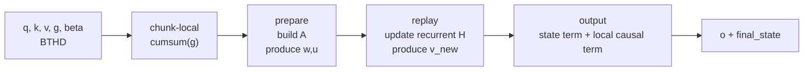
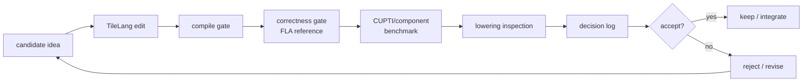
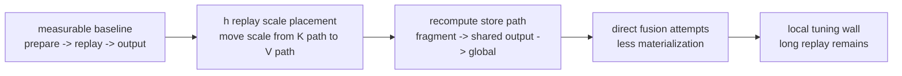
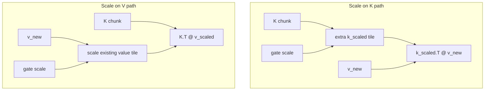
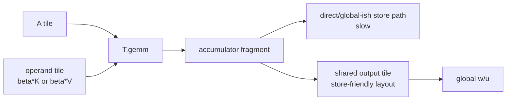
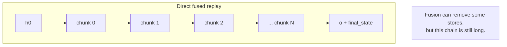
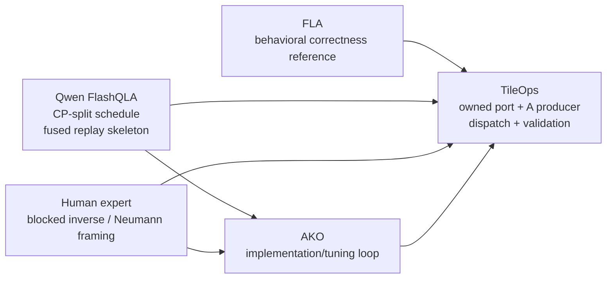
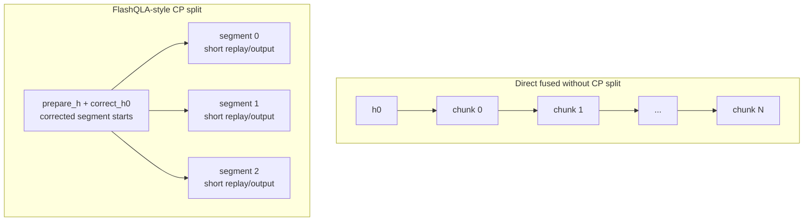
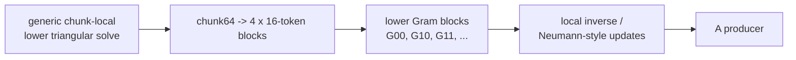
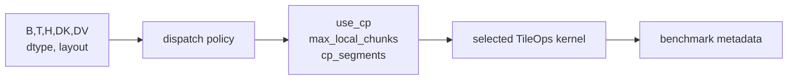

# Agentic TileLang Kernel Tuning: Gated DeltaNet Prefill

Reader note: detailed evidence, rejected rows, ABI caveats, and benchmark
metadata live in `tutorial_v3_si.md`. The diagrams below are lightweight
Mermaid sketches.

## 0. Problem, Result, And How To Read The Numbers

Gated DeltaNet prefill is hard because it wants parallel throughput while
carrying a recurrent key-value memory whose final state must match
token-by-token decode. The kernel cannot only be fast; it must preserve the
same causal state evolution across tens of thousands of tokens.

The result of this case study is a TileOps-owned production prefill path that
combines local agentic optimization, a FlashQLA-inspired CP-split replay
schedule, and a human blocked-inverse / Neumann-style prepare algorithm. On the
refreshed serving-shape sweep, the production dispatch path is faster than both
the recorded FLA reference and the public FlashQLA TL0.1.8 anchor under the
documented benchmark contracts. The FlashQLA comparison is a
public-environment comparison, not a controlled same-lowering attribution
experiment; the FLA row is a recorded vendored reference unless otherwise
stated.

This is not a story about an AI magically inventing a faster GPU kernel. It is
a story about how agents become useful when a kernel problem is made
measurable, and where they still need human judgment and expert open-source
references.

It is a good stress test for AI-assisted kernel work because it is not "just a
GEMM." The operator combines chunk-local causal dependencies, recurrent memory,
gate decay, delta-rule residual writes, output replay, final-state production,
and shape-sensitive long-context serving.

The core lesson is:

```text
Agents can reconstruct and refine a measurable search space; experts and
expert kernels reshape it.
```

In this project, the agent was useful in three different roles:

1. **Make the operator correct and measurable.**
   Read paper/reference code, reconstruct the prefill computation, build
   correctness tests, component benchmarks, lowering inspection, and logs.

2. **Search local implementation choices inside a fixed contract.**
   Try TileLang rewrites, memory movement changes, store-path variants,
   scale-placement changes, and small fusion candidates under correctness and
   latency gates.

3. **Implement and tune a new search space once external input changes it.**
   Human mathematical analysis reframed the prepare stage as a blocked
   inverse / Neumann-style producer. Qwen's FlashQLA showed the production
   CP-split replay schedule and fused replay/output skeleton for long
   prefill. TileOps then studied, ported, tuned, dispatched, benchmarked, and
   productionized those ideas in an owned implementation.

That boundary matters. TileOps did not invent the CP-split replay schedule.
The contribution was to study, validate, port, tune, dispatch, benchmark, and
productionize the FlashQLA-style schedule inside TileOps, combined with
TileOps' own A producer. At the same time, the work was not "just copying
FlashQLA": the TileOps path includes an owned BTHD production implementation,
a faster specialized A producer, shape-aware dispatch, correctness validation,
and production benchmark integration.

This article therefore uses a three-level structure rather than a chronological
round diary. The performance story should also be read as a sequence of
milestones, control rows, and anchors, not as disconnected per-section tables.

The rewritten structure is:

| Part | Purpose |
| --- | --- |
| 0. Problem, result, and evidence contract | Define the problem, headline result, evidence lanes, and terminology. |
| 1. Understanding the operator | Explain why GDN prefill is a recurrent-memory scheduling problem. |
| 2. Make the operator measurable | Build correctness, benchmark, lowering, and decision gates. |
| 3. Search local implementation choices | Show local AKO wins and the fixed-contract wall. |
| 4. Expand the search space | Explain the external search-space expansions: FlashQLA schedule and human blocked-inverse / Neumann prepare. |
| 5. Guardrails and evidence | Separate formal rows, anchors, caveats, negative results, and open evidence items. |

### 0.1 Representative Roadmap

Relative performance is reported as throughput relative to a reference:
`reference_latency / variant_latency * 100%`. `100%` means parity with the
reference; values above `100%` mean the variant has higher throughput than the
recorded reference. Component diagnostics still appear in the body, but they do
not enter the headline roadmap until they have a matching full-op row.

The single-shape story rows share the same serving shape:
`B=1,T=65536,H=16,DK=DV=128,chunk64,fp16,BTHD`, but they come from two evidence
lanes. The early/local rows are end-to-end historical worktree checkpoints
under the formal ladder harness. The Level 3 A-producer rows use the same-input
Section 11 clean ablation, because that is where the TL0.1.8-lowering
FlashQLA-style prepare row and the TileOps Neumann prepare row are directly
paired. Component-only scale/store diagnostics are kept out of this headline
table. The public-facing roadmap names story nodes, not internal variant IDs;
the exact variant-to-code mapping is maintained in the supporting information
and evidence inventory.

**Controlled `64K/H16` story rows**

| Story node | Blog meaning | Latency | Perf vs recorded FLA (%) | Perf vs public FlashQLA anchor (%) |
| --- | --- | ---: | ---: | ---: |
| initial correctness | the first serving prefill op is correct and measurable | `11.1762 ms` | `71.8%` | `11.7%` |
| local prepare specialization | local AKO improves the fixed-contract path, but does not change replay depth | `10.8353 ms` | `74.1%` | `12.1%` |
| local wall | BTHD/local tuning helps a lot, but the path is still a long legacy replay | `5.5566 ms` | `144.4%` | `23.5%` |
| FlashQLA-style A + TileOps replay | after studying FlashQLA and improving replay/output, TileOps reaches the public FlashQLA performance neighborhood before Neumann | `0.815029 ms` | `984.7%` | `160.3%` |
| Neumann prepare | human expert insight provides the blocked-inverse / Neumann-style prepare algorithm | `0.695237 ms` | `1154.4%` | `188.0%` |

**External `64K/H16` anchors**

| Anchor | Role | Latency | Perf vs recorded FLA (%) | Perf vs public FlashQLA anchor (%) |
| --- | --- | ---: | ---: | ---: |
| recorded FLA reference | behavioral correctness reference and FLA baseline | `8.02574 ms` | `100.0%` | `16.3%` |
| public FlashQLA TL0.1.8 anchor | public environment anchor for the CP-split schedule family | `1.306838 ms` | `614.1%` public-env | `100.0%` |

**Production dispatch surface**

| Surface | Role | Latency range | Perf vs recorded FLA (%) | Perf vs public FlashQLA anchor (%) |
| --- | --- | ---: | ---: | ---: |
| five serving shapes | the optimized path becomes a dispatchable kernel family across shape space | `0.3723-2.3085 ms` | `822%-1330%` | `146%-291%` public-env |

The local rerun also measured an h-tile diagnostic at `10.1631 ms`, but that row
failed the formal `atol=rtol=5e-2` correctness gate, so it stays out of the
positive roadmap. The first correct CP adaptation after studying FlashQLA was
`2.7674 ms`; it is useful as process evidence, but not performance-near
FlashQLA, so it also stays out of the headline roadmap.

Component diagnostics, failed candidates, and migration/lowering anchors belong
in the supporting evidence or appendix. A rejected or unresolved row may appear
only as diagnostic context; it must not be read as a formal result.

Do not mix component rows, external FlashQLA anchors, and TileOps
experiment-adapter rows into one apparent speedup ladder.

### 0.2 Terminology And Scope

This article compares TileOps, FLA, and FlashQLA in three different roles:

| Term | Role in this article |
| --- | --- |
| GDN | Gated DeltaNet, a recurrent linear-attention-style operator with decay gates and delta-rule residual writes. |
| FLA | Flash Linear Attention. The main behavioral correctness reference for full-op validation; reported here as a recorded vendored FLA reference unless package identity is explicitly verified. |
| FlashQLA | Qwen's FlashQLA project. The source of the CP-split GDN prefill schedule and fused replay/output skeleton that TileOps later ported and productionized. |
| TileOps | The production kernel surface discussed here: TileLang-owned BTHD prefill path, dispatch, validation, and benchmark integration. |
| AKO | Agentic Kernel Optimization: a gated loop of hypothesis, implementation, correctness, benchmark, lowering inspection, and decision logging. |
| BTHD | `[batch, time, heads, dim]`, the main serving layout used in the FLA/Qwen-style path discussed here. |
| chunk | A fixed token block. The production path discussed in this work uses `chunk64` for the benchmark rows. |
| prepare | Chunk-local causal work that produces effective writes used by replay/output. |
| replay | Cross-chunk recurrent state update. |
| CP split | FlashQLA-style schedule that computes corrected segment initial states, then runs fused replay/output over shorter segments. |

The target serving shape in the main evidence package is intentionally scoped:
`B=1`, BTHD layout, `DK=DV=128`, `chunk64`, `fp16`, and long prefill lengths.
The reported numbers are tied to the recorded commit, timer, input artifact,
GPU, and runtime metadata in SI.

For FlashQLA comparisons, use the following caveat:

```text
TileOps vs FlashQLA is a public-environment comparison, not a controlled
same-lowering replay attribution experiment.
```

## 1. Understanding The Operator

This part builds the operator model before any kernel tuning appears. The goal
is to make the reader understand why GDN prefill is hard: it is a recurrent
memory update with chunk-local causal work, long cross-chunk replay, and an
output path that must remain equivalent to token-by-token decode.

Standard attention computes pairwise token interactions, even when modern
kernels avoid materializing the full matrix. Linear attention-style models
avoid the full quadratic interaction pattern by maintaining a recurrent state.
Gated DeltaNet adds two important features to that state:

- a decay gate `g`, which controls how much previous memory survives;
- a delta-rule update, which writes residual information instead of blindly
  accumulating values.

At a high level, each token does four things:

```text
forget old memory -> read with k_t -> write a residual -> read output with q_t
```

This gives GDN a useful memory signal-to-noise story: if the current key
already retrieves something close to the current value, the update can write
less redundant information. But it also makes prefill harder. Token `t`
depends on the state produced by earlier tokens, and the prefill kernel must
process a long prefix without changing that causal result.

The difficulty appears at three layers:

1. **Mathematical dependency.**
   Each token both reads from and writes to a recurrent `[K, V]` state. Inside
   a chunk, this creates a causal lower-triangular dependency pattern.

2. **Parallel schedule.**
   Some work is naturally chunk-local. Other work, especially long replay
   across chunks, remains recurrence-like unless the schedule changes.

3. **Hardware pipeline.**
   Equivalent equations can become very different kernels depending on whether
   data lives in HBM, shared memory, tensor-core fragments, or global stores.

This is why a "fused" kernel is not automatically a fast kernel. Fusion can
remove global intermediate tensors, but it does not by itself shorten the
causal replay dependency. That distinction becomes central later when the
article reaches FlashQLA's CP-split schedule.

### 1.1 GDN As A Recurrent Memory

This section uses implementation-facing schematic notation. It fixes the
computation shape the reader needs for the rest of the article: recurrent
memory read, gated decay, delta-style erase/write, chunk-local prepare, and
cross-chunk replay. The implementation-scoped prepare formula appears later in
Section 4.2, with the ABI caveat that different kernels may split gate and beta
factors across the A producer and replay/output kernel.

For one `(batch, head)` stream, the inputs are:

```math
\begin{aligned}
q_t, k_t &\in \mathbb{R}^{K}, \\
v_t &\in \mathbb{R}^{V}, \\
g_t &\in \mathbb{R}, \\
\beta_t &\in \mathbb{R}, \\
H_t &\in \mathbb{R}^{K \times V}.
\end{aligned}
```

The decode intuition is:

```math
\begin{aligned}
w_t &= \beta_t k_t, \\
u_t &= \beta_t v_t, \\
\widehat{u}_t &= \mathrm{read}_s(w_t, H_{t-1}), \\
r_t &= u_t - \mathrm{gate}(\widehat{u}_t), \\
o_t &= \mathrm{read}_s(q_t, H_{t-1})
     + \mathrm{read}_{local}(q_t, k_t, r_t), \\
H_t &= \mathrm{decay}(H_{t-1}) + \mathrm{write}(k_t, r_t).
\end{aligned}
```

The important idea is the residual write. GDN does not simply add
`beta_t * v_t` into memory. It reads what the old memory already predicts
under `k_t`, then writes the remaining information. The gate controls memory
lifetime and coordinate scaling; `beta` controls write strength.

For prefill, the operator cannot run this recurrence token by token. It first
groups tokens into chunks. The chunk-local prepare stage turns intra-chunk
causal dependencies into effective writes:

```text
k_beta = beta[:, None] * k
v_beta = beta[:, None] * v

w = A @ k_beta
u = A @ v_beta
```

Here `A` encodes the lower-triangular chunk-local delta-rule solve. In decode,
`w_t` and `u_t` are just `beta_t k_t` and `beta_t v_t`; in chunkwise prefill,
`w` and `u` are effective writes after absorbing causal dependencies inside
the chunk. This is the first key conceptual split: chunkwise prefill is not
just vectorized decode.

Once `w` and `u` are available, the operator has three stages:

```text
prepare -> replay -> output
```

Schematic code shape:

```python
# Stage 1: chunk-local prepare
A = build_chunk_local_A(k, g, beta)
w, u = recompute_w_u_from_A(k, v, beta, A)

# Stage 2: replay recurrent state across chunks
for chunk in chunks:
    v_new = u_chunk - gated_state_read(w_chunk, H)
    H = gated_state_update(H, k_chunk, v_new)

# Stage 3: output
o_state = state_contribution(q_chunk, H_in)
o_local = causal_chunk_contribution(q_chunk, k_chunk, v_new)
o = o_state + o_local
```

Figure 1 sketches the dataflow.



This is the logical operator decomposition. Later production kernels may fuse
replay and output or change the replay schedule, but the same component
boundaries remain useful for testing and attribution.

The figure is deliberately higher-level than a kernel listing. The purpose is
to expose component boundaries that can be tested, timed, and optimized.

## 2. Level 1 - Make The Operator Measurable

Level 1 is the correctness and measurement layer. Before the agent can tune a
kernel, it needs a reference, a decomposition, a timer, lowering artifacts, and
a decision log that makes each candidate accept/reject outcome auditable.

The first useful agent capability was not performance tuning. It was helping
turn the operator into something that could be tested and measured.

That required four artifacts:

1. **A decomposition.**
   The agent helped organize the computation into `prepare -> replay ->
   output`, matching the shape of the reference implementations and the
   TileOps kernel surface.

2. **A correctness reference.**
   FLA is the main behavioral correctness reference for the full operator.
   FlashQLA is mainly a schedule/source/performance reference unless stated
   otherwise.

3. **A benchmark surface.**
   Full-op latency is necessary, but component latency is what makes local
   tuning directional. Prepare, replay, output, and later CP preprocess need
   separate attribution.

4. **A decision log.**
   Candidate kernels are not accepted because they look plausible. They pass
   compile, correctness, latency, lowering, and integration gates.

This is the AKO loop used throughout the project:

```python
candidate = build_tilelang_kernel(config)
correctness_ref = fla_reference
schedule_ref = flashqla_source_if_needed

correct = check_against_reference(
    candidate,
    reference=correctness_ref,
    shapes=validated_shapes,
)

if correct:
    latency = cupti_bench(
        candidate,
        warmup=warmup,
        repeat=repeat,
        trials=trials,
    )
    lowering = inspect_generated_code(candidate)
else:
    latency = None
    lowering = None

decision_log.write({
    "config": config,
    "correct": correct,
    "latency_ms": latency,
    "lowering_notes": lowering.summary if lowering else None,
    "decision": accept_or_reject(correct, latency, lowering),
})
```

Figure 2 shows the same loop visually.



This loop is what makes the agent useful. Without it, "agentic tuning" is just
unbounded code generation. With it, the agent can propose small kernel changes,
run them through the same evidence gates, and build a trace of what worked and
what failed.

The gates also protect the narrative. A historical row can explain why a
candidate was pursued, but it cannot become a final public claim unless it is
refreshed at the final PR head. A source-level similarity can motivate a
migration, but it cannot justify a TMA/WGMMA claim unless the generated code
was inspected and archived. A full-op FlashQLA speedup can be reported under
its environment, but it cannot be described as a replay algorithm superiority
claim without a controlled same-lowering experiment.

That discipline is the base layer for the rest of the article. Level 2 will
show what the agent could optimize inside this measured space: scale
placement, store paths, and early fusion attempts. Level 3 will show what
happened when external input changed the search space: human blocked
inverse/Neumann prepare, and Qwen FlashQLA's CP-split schedule for long replay.

## 3. Level 2 - Local AKO Inside A Fixed Contract

Level 2 is where local agentic kernel optimization works well. The math and
schedule contract stay fixed, while the agent searches TileLang expression
choices, memory paths, staging choices, and small fusion candidates under the
same correctness and benchmark gates.

Once the operator was measurable, the agent could start doing useful kernel
work. The important phrase is "inside a fixed contract." In Level 2, the
agent is not changing what GDN computes, not changing the long-replay
schedule, and not introducing a new mathematical formulation of prepare. It is
searching implementation choices that should preserve the same component
semantics.

This is the part of the story where agentic tuning works best:

```text
same math
same input/output contract
same correctness reference
different TileLang expression or data path
```

The wins here are real, but they also reveal a ceiling. Local AKO can remove a
buffer, fix a store path, or reject a tempting fusion. It cannot, by itself,
turn a long recurrence into a shorter one unless the search space is changed.
That distinction is the bridge to Level 3.

A concrete AKO episode in this section has five parts:

```text
hypothesis -> TileLang edit -> correctness gate -> benchmark/lowering evidence
           -> keep, reject, or turn into a sharper next question
```

Two examples make the agentic part less abstract. Evidence pointers:
`../../evidence/ladder/summaries/blog_ladder_evidence_64k_h16.md` and
`../../evidence/ladder/docs/variant_inventory.md`.

**Episode A: scale placement.**

- Hypothesis: under this replay recurrence, ABI, dtype, and correctness
  contract, the per-token gate scale can move from the key tile to the value
  tile without changing the operator result.
- TileLang move: apply the scale on the value tile that already feeds the state
  update.
- Gate result: correctness was preserved, and replay component latency improved
  in historical diagnostics.
- Decision: keep as a local data-path win.

**Episode B: direct fusion.**

- Hypothesis: if global intermediates are expensive, fusing replay/output should
  solve long-context latency.
- TileLang move: prototype a fused path that writes only `o` and `final_state`.
- Gate result: correctness/compile/latency evidence showed that fusion alone
  did not remove the long replay dependency.
- Decision: reject as the main long-context answer; use the failure to motivate
  CP split.

The important pattern is not that the agent always picked the final global
direction. It generated plausible local moves, ran them through gates, and made
their limits visible enough for the next search-space change to be justified.

Figure 3 summarizes the local tuning ladder.



### 3.1 Local Win: Move The Scale, Remove The Buffer

The first clean local win came from the replay update. The recurrence update
contains a per-token gate scale. One expression scales the key side before the
matrix multiply:

```python
k_scaled = k_chunk * exp(g_last - g_i)[:, None]
H += k_scaled.T @ v_new
```

The equivalent expression scales the value side instead:

```python
v_scaled = v_new * exp(g_last - g_i)[:, None]
H += k_chunk.T @ v_scaled
```

Mathematically this is just moving a scalar across an outer product:

```math
\sum_i (s_i k_i)v_i^\top
=
\sum_i k_i(s_i v_i)^\top
```

But the TileLang kernel sees a different data path. Scaling `k` creates an
extra staged key tile. Scaling `v_new` applies the per-token factor on the
value tile that already flows into the update.

TileLang-shaped snippet:

```python
for i, j in T.Parallel(block_C, BV):
    v_new_c[i, j] *= T.exp2((g_last - g_c[i]) * LOG2E)

T.gemm(k_c, v_new_c, H_next_frag, transpose_A=True)
```

Figure 4 shows the buffer-level difference.



The lesson is not that the agent invented new GDN math. It found a
semantics-preserving algebraic placement that changed the memory path. This
is exactly the kind of search Level 2 is good at: local, testable, and gated
by the same reference.

Historical diagnostic evidence:

These are dated component diagnostics, not headline benchmark claims. They are
kept here because they explain why the scale-placement candidate was accepted.

**Picked variant for this node:** V-path scale placement, with historical
replay component latency improving from `2.2725 ms` to `1.6277 ms`.

| Variant | Replay component latency | Scope |
| --- | ---: | --- |
| staged K-scale path | `2.2725 ms` | historical component diagnostic |
| V-path scale placement | `1.6277 ms` | historical component diagnostic |

These rows show why the scale-placement rewrite mattered, but they are
trajectory evidence, not final public benchmark claims.

### 3.2 Local Diagnostic: The Store Path Was The Bottleneck

The second Level 2 lesson came from recomputing the effective writes `w` and
`u` from the chunk-local matrix `A`. At a high level, the arithmetic is simple:

```text
w_tile or u_tile = A_tile @ operand_tile
```

That makes it tempting to focus only on the matrix multiply primitive. Many
candidate kernels did exactly that: improve operand staging, use async copies,
and try to make the GEMM body look more like the expert path.

The no-store diagnostic changed the interpretation. In that experiment, the
kernel ran the compute path but skipped the final global stores. The
historical component benchmark showed a clear latency reduction, indicating
that the GEMM body was not the only thing that mattered. The output path was a
first-class part of the kernel.

The accepted shape routed accumulator fragments through a store-friendly
shared tile before writing global memory:

```python
T.gemm(A_s, operand_s, out_frag)

# Store-friendly staging path.
T.copy(out_frag, out_s)
T.copy(out_s, global_out_tile)
```

Figure 5 shows the diagnostic.



The important lesson is:

```text
Matching the arithmetic primitive is not the same as matching the pipeline.
```

Historical diagnostic evidence:

These are dated component diagnostics, not headline benchmark claims. They are
kept here because they explain why the store path became a first-class tuning
target.

**Picked variant for this node:** swizzled async shared-copy store path, with
historical TileLang component latency improving from `0.46791766 ms` to
`0.27223574 ms`.

**Component microbenchmark: prepare store path only.** These rows compare one
historical prepare subcomponent, not the end-to-end GDN prefill path used in
the main ladder tables.

| Candidate | Correctness | TileLang component latency | Same-run Triton component | Lesson |
| --- | --- | ---: | ---: | --- |
| copy baseline | exact | `0.46791766 ms` | `0.30507803 ms` | correct but far behind Triton |
| no-store diagnostic | skipped by design | `0.13233657 ms` | `0.30706382 ms` | compute path was not the bottleneck |
| shared-copy store | exact | `0.37684782 ms` | `0.30497479 ms` | shared staging helped the store path |
| swizzled async shared-copy | exact | `0.27223574 ms` | `0.30525394 ms` | store-friendly layout was decisive |

This is where lowering inspection earns its place in the AKO loop. Seeing an
expected primitive in the source or generated code is not enough. The kernel
can still lose in synchronization, layout conversion, or global store traffic.
The agent can propose and test variants, but component timing and generated
code inspection decide which story is true.

### 3.3 Local Wall: Fusion Alone Did Not Shorten Replay

After scale placement and store-path tuning, the natural next hypothesis was
fusion. If the pre-CP component path spends time writing and reading
intermediate `w/u/S/v_new`-like tensors, perhaps a fused kernel can keep more
of the path local and write only the final outputs.

That hypothesis was reasonable. It was also incomplete.

A direct fused skeleton can reduce materialization:

```text
q,k,v,A,g,beta
  -> fused replay/output
  -> o, final_state
```

But if the fused kernel still processes the entire sequence as one long replay
chain, the causal dependency depth is unchanged:

```text
h0 -> chunk0 -> chunk1 -> chunk2 -> ... -> chunkN
```

Figure 6 shows why this matters.



This was the Level 2 wall:

```text
less materialization != shorter recurrence
```

End-to-end wall checkpoint:

| Node | Accepted fixed-contract full-op evidence | `64K/H16` latency | Decision |
| --- | --- | ---: | --- |
| initial correct prefill | `local_initial_prefill_f147` historical worktree row | `11.1762 ms` | keep as the first measurable serving op |
| local prepare specialization | `local_prepare_specialized_00a60` historical worktree row | `10.8353 ms` | local AKO gives a real full-op gain |
| local wall | `local_bthd_wall_d09c` historical worktree row | `5.5566 ms` | local BTHD tuning helps, but replay remains a long fixed-contract path |

The rejected fusion candidates were useful because they clarified the boundary.
Local fusion can improve the data path inside a schedule, but it does not
automatically change the schedule's dependency structure. A fused kernel can
write fewer tensors and still be slow if it is replaying a long prefix as one
chain.

The same rerun measured `local_h_tile_tuned_827 = 10.1631 ms`, but it failed
the formal correctness gate, so it remains diagnostic rather than a positive
story row.

This is the point where Level 2 runs out of room. The agent had improved
local implementation choices and identified the bottleneck, but the next
performance jump needed a different search space. That is where Level 3
begins.

## 4. Level 3 - External Input Changes The Search Space

Level 3 is where the search space changes. FlashQLA supplied the
production-grade CP-split replay schedule family; human mathematical analysis
supplied the blocked-inverse / Neumann-style prepare producer. The TileOps work
then became an adaptation, implementation, tuning, and productionization story
inside those expanded spaces.

Level 2 found useful local improvements, but it also found the wall. The
operator was correct and measurable. The agent could move a scale, fix a store
path, and reject shallow fusion. But the hot path still contained two deeper
problems:

1. the long replay path needed a schedule that did not process the whole
   prefix as one long recurrence chain;
2. the prepare stage needed a stronger producer shape for the chunk-local
   correction matrix `A`.

Those changes did not come from unconstrained local AKO. They came from
external input that reshaped the search space:

- Qwen FlashQLA provided the production CP-split replay schedule and fused
  replay/output skeleton;
- human mathematical analysis reframed prepare as a blocked inverse /
  Neumann-style producer.

The agent became useful again after those search spaces existed: implement
candidates, run correctness gates, inspect lowering, benchmark variants,
record decisions, and help productionize the path.

The order in this section is conceptual rather than chronological. The
human blocked inverse / Neumann-style prepare work existed before the
FlashQLA-specialized phase. The article discusses FlashQLA first here because
it explains the long-replay side of the final production path; the Neumann
section then explains the stronger TileOps A producer plugged into that
schedule family.

Figure 7 summarizes the attribution map.



This map is deliberately blunt. It prevents both bad stories: TileOps did not
invent FlashQLA's CP-split replay schedule, and the TileOps work was not just
reproducing a finished FlashQLA kernel.

### 4.1 Expert Reference: FlashQLA CP-Split Replay

Qwen FlashQLA supplied the production reference for attacking the long replay
bottleneck. TileOps did not invent the CP-split replay schedule. The
contribution was to study that schedule family, rebuild a TileOps-owned
downstream implementation, and then test it under controlled and
cross-ablation evidence. The formal V5 row below is not the performance
reproduction of FlashQLA; it is a controlled bridge row with a conservative
generic A producer.

The schedule-level idea is:

```text
first compute valid segment initial states
then run fused replay/output over shorter segments
```

This is different from direct fusion. Direct fusion can remove some global
stores while preserving one long recurrence chain:

```text
h0 -> chunk0 -> chunk1 -> chunk2 -> ... -> chunkN
```

CP split adds a preparation/correction step that makes shorter local replay
segments valid:

```text
prepare_h / correct_h0
  -> segment0: chunk0 -> ... -> chunkK
  -> segment1: chunkK+1 -> ...
  -> segment2: ...
```

Figure 8 makes the distinction explicit.



The right side must include `prepare_h/correct_h0`; CP segments are not
naturally independent. They become valid because the schedule computes
corrected segment initial states first.

At the source level, the production-shaped flow is:

```python
# Production long-prefill schedule, credited to Qwen FlashQLA.
g = chunk_local_cumsum(g)
A = kkt_solve_or_blocksolve(k, g, beta)

warmup_chunks = get_warmup_chunks(...)
h_warmup = prepare_h(k, v, A, g, beta, warmup_chunks)
h0 = correct_h0(initial_state, h_warmup, cp_metadata)

o, final_state = fused_gdr_fwd(
    q, k, v, A, g, beta,
    initial_state=h0,
    cp_seq_map=cp_seq_map,
)
```

In this skeleton, the A producer is intentionally abstract. FlashQLA supplies
the CP-split replay schedule and fused replay/output skeleton; TileOps later
plugs in its owned A producer.

The important output contract is still simple:

```text
q, k, v, g, beta -> o, final_state
```

The schedule win is that the inference prefill path avoids materializing large
global `w/u/S/v_new`-style intermediates while also shortening the replay
dependency through CP-split segment starts.

Schedule evidence:

**Picked evidence for this node:** present FlashQLA learning as a three-step
experiment, not as a single pass/fail row.

| Node | Evidence | Meaning |
| --- | --- | --- |
| local wall | local full-op rerun reached `local_bthd_wall_d09c = 5.5566 ms`, but the path still used long legacy replay | local AKO needed an external schedule idea |
| first correct adaptation | V5 `tileops_owned_cp_generic_a = 2.7674 ms` | the FlashQLA CP idea had been adapted into TileOps, but the result was not performance-near FlashQLA |
| no-Neumann prepare-A full row | TL0.1.8-lowering FlashQLA-style prepare A + TileOps replay/output full combined latency: `0.815029 ms` | the FlashQLA-style producer plus TileOps replay reaches the expected performance neighborhood |

This third node is now filled with a measured external-lowering harness row.
V5 was the first correct adaptation, not the finished schedule implementation.
The `0.815029 ms` combined row shows how much of the gap is replay/output and
how much is prepare-A before switching to the stronger TileOps producer.

That makes V5 useful rather than embarrassing. Its underperformance, together
with the mixed TileOps-owned implementation path and conservative generic A
producer, is evidence that this was an adaptation of a schedule idea rather than
a finished-kernel reproduction. The more realistic agentic pattern is: borrow a
schedule idea, build a TileOps-owned partial adaptation, observe that the first
adaptation is still incomplete, then use the failure to ask sharper attribution
questions.

Conceptually, the CP-split schedule explains the long-replay side of the
production path. The other half of the production path is the A producer, whose
stronger TileOps shape came from an earlier human blocked inverse /
Neumann-style reframing.

### 4.2 Human Search-Space Expansion: Blocked Inverse / Neumann Prepare

The prepare stage builds the chunk-local correction matrix `A` used to produce
the effective writes `w` and `u`. In the FlashQLA-style flow, `A` is one of
the inputs to the CP-split replay/output path. Strengthening this producer
helps the same schedule family; it is not a different replay algorithm.

Before this point, `build_chunk_local_A` was a logical placeholder: a
chunk-local triangular/KKT-like solve that the rest of the pipeline consumed.
The human insight was to stop treating prepare as merely "write the same
triangular solve in TileLang." For a `chunk64` block, the problem can be
viewed as a blocked lower-triangular inverse/update problem:

```text
64-token chunk
-> four 16-token blocks
-> lower-triangle-only Gram products
-> local inverse / Neumann-style updates
-> chunk-local A producer
```

The useful mathematical object is the chunk-local lower-triangular correction
matrix. The following is an operator-level schematic for the TileOps
implementation family, not a claim that every implementation materializes
exactly this tensor with exactly this factor placement. For a chunk of length
`C`, define a strictly lower-triangular interaction matrix:

```math
M_{i,j} =
\begin{cases}
\beta_i \exp(g_i - g_j)\,\langle k_i, k_j\rangle, & i > j, \\
0, & i \le j .
\end{cases}
```

Then the effective writes have the shape:

```math
\begin{aligned}
A &= (I + M)^{-1}, \\
R_K &= \text{beta-scaled keys under the chosen ABI}, \\
R_V &= \text{beta-scaled values under the chosen ABI}, \\
W &= A R_K, \\
U &= A R_V .
\end{aligned}
```

This is the notation to keep in the article: `A` is a left-multiply correction
over the token axis. It turns raw ABI-scaled keys and values into effective
writes that already include the causal delta-rule corrections within the
chunk. The key interaction term $\langle k_i, k_j\rangle$ is essential:
without it, the formula would not represent the Gram-style erase/correction
structure used by the prepare kernel.

There is one implementation convention to state carefully. In the partitioned
CP path, TileOps builds the materialized `A` with a zero gate input and passes
the chunk-local cumulative gate `g_cum` separately to the CP replay/output
path. In the older non-CP prepare path, the gate factor can be folded directly
into `A`. The blog should present the formula above as the mathematical
operator view, then say the production ABI may split the gate factor between
the A producer and the replay kernel.

A Neumann view explains why this is an attractive producer shape. Because `M`
is strictly lower triangular inside a fixed chunk:

```math
(I + M)^{-1} = I - M + M^2 - M^3 + \cdots
```

For a `C x C` strictly lower-triangular matrix, `M` is nilpotent:
$M^C = 0$. So this is not an infinite approximation; it is an exact finite
series that truncates after at most $C - 1$ powers. The engineering point is
not "use a random approximation instead of the operator." The point is that
the causal correction has a lower-triangular inverse/update structure that can
be blocked and specialized.

For the production `chunk64, DK=128` path, TileOps splits the chunk into four
16-token blocks. If `B_r = I + M_rr` is the diagonal block and `L_rs = M_rs`
is a lower off-diagonal block, the ideal block inverse recurrence is:

```math
\begin{aligned}
A_{r,r} &= B_r^{-1}, \\
A_{r,s} &= -B_r^{-1}\sum_{m=s}^{r-1} L_{r,m}A_{m,s}, \quad r > s .
\end{aligned}
```

This recurrence is the algorithmic shape behind the blocksolve producer. The
implementation computes the ten lower Gram blocks
`G00, G10, G11, ..., G33`, applies the beta/gate scalings, forms local
diagonal inverses with a Neumann-style update, and composes the off-diagonal
blocks with a fixed sequence of small GEMMs in shared memory.

The multiply-add accounting makes the tradeoff concrete. Counting one
multiply-add as one MAC, a dense `64 x 64` Gram over `DK=128` would cost
`64 * 64 * 128 = 524,288` MACs per chunk/head. The strict causal off-diagonal
interaction has `64 * 63 / 2` token pairs, or `258,048` MACs; if the diagonal is
included as a lower-triangular Gram reference, the count is `64 * 65 / 2 * 128 =
266,240` MACs. The production blocked shape computes ten dense `16 x 16` Gram
blocks, so the Gram stage costs
`10 * 16 * 16 * 128 = 327,680` MACs: more than the exact elementwise lower
triangle because the four diagonal blocks keep a dense GEMM shape, but much
less than the full dense grid. The block inverse/composition then adds
twenty-four `16 x 16 x 16` small GEMMs, or another `98,304` MACs. So the
prepare-A producer performs about `425,984` GEMM MACs per chunk/head before
scalar beta/gate work. For the formal `B=1, T=64K, H=16, chunk64` row, that is
`16,384` chunk/heads, or about `6.98B` prepare-A GEMM MACs. The win is therefore
not a magical disappearance of arithmetic; it is turning the necessary causal
correction into a lower-blocked, regular GEMM-shaped schedule with a
small fixed block-composition tail.

If we compare only the inversion strategy, the arithmetic story is simple:
FlashQLA's forward hierarchical solve/combine tail is slightly lighter, about
`89,600` MACs per chunk/head, while the TileOps blocked inverse /
Neumann-style tail is about `98,304` MACs. That matches the intuition that
forming a reusable blocked inverse/composition can do a little more arithmetic
than a forward solve. The reason it can still be attractive is parallel shape:
the TileOps tail is a fixed sequence of small GEMMs over `16 x 16` blocks,
rather than a mostly forward-substitution-shaped dependency chain.

The accepted variant should therefore be described as a **blocked-inverse /
Neumann-style A producer**, not as a proof that the materialized `A` is
identical to the generic exact/KKT-style producer. Direct intermediate-`A`
comparison details stay in SI; full-op correctness is what is validated.

Figure 9 shows the shape.



TileLang-shaped code skeleton:

```python
# 64-token chunk split into four 16-token blocks.
G00 = k0 @ k0.T
G10 = k1 @ k0.T
G11 = k1 @ k1.T
...
G33 = k3 @ k3.T

# Build beta/gate-scaled lower blocks M_rs.
B0 = I + lower(beta_gate_scale(G00))
B1 = I + lower(beta_gate_scale(G11))
B2 = I + lower(beta_gate_scale(G22))
B3 = I + lower(beta_gate_scale(G33))
L10 = beta_gate_scale(G10)
L20 = beta_gate_scale(G20)
...

# Local diagonal inverse/update.
A00 = neumann_style_inverse(B0)
A11 = neumann_style_inverse(B1)
A22 = neumann_style_inverse(B2)
A33 = neumann_style_inverse(B3)

# Compose lower off-diagonal blocks.
A10 = -A11 @ L10 @ A00
A21 = -A22 @ L21 @ A11
A20 = -A22 @ (L20 @ A00 + L21 @ A10)
...
A = assemble_lower_block_matrix(A00, A10, A11, A20, A21, A22, ...)
```

This belongs in Level 3 because the search space itself came from human
mathematical analysis. Once that framing existed, the agentic loop was useful
again: implement variants, run gates, inspect lowering, and tune inside the
new producer shape.

Three nearby numbers appear in the evidence package, and they mean different
things:

| Number | Evidence lane | Meaning |
| ---: | --- | --- |
| `0.715062 ms` | V5/V6 experiment-adapter bridge | Shows that the blocked-inverse producer can feed the same CP downstream ABI, but it is not the clean A-producer proof. |
| `0.695237 ms` | Section 11 same-input A-producer ablation | The headline Neumann prepare comparison against the `0.815029 ms` TL0.1.8-lowering FlashQLA-style prepare row. |
| `0.692026 ms` / `~0.6951 ms` | production wrapper and refreshed dispatch surface | Production-context evidence that the optimized path survives wrapper/dispatch policy; not the Section 11 proof. |

Formal A-producer evidence:

**Picked evidence for this node:** compare complete end-to-end rows where the
replay/output schedule is production-shaped and the prepare-A producer changes.
The main claim uses complete end-to-end rows, not component sums. The
FlashQLA-style no-Neumann row is measured by injecting the public TL0.1.8
lowered KKT kernel through an external launcher, then feeding its `A` plus
current `chunk_local_cumsum` into the unchanged TileOps PR1596 replay path.

Evidence note:
`../../evidence/ladder/summaries/section11_a_producer_ablation_64k_h16.md`.

| Row | Prepare-A producer | Replay/output | Timing scope | Correctness | `64K/H16` latency | Use |
| --- | --- | --- | --- | --- | ---: | --- |
| public FlashQLA full | public FlashQLA TL0.1.8 KKT | public FlashQLA TL0.1.8 CP replay | full public op | pass / public anchor | `1.306838 ms` | external baseline |
| FlashQLA-style prepare A + TileOps replay | TL0.1.8 lowered FlashQLA KKT via external launcher | TileOps PR1596 CP replay | full combined row | pass vs public TL0.1.8 artifact | `0.815029 ms` | measured no-Neumann combined row |
| TileOps prepare A + TileOps replay | TileOps blocked-inverse / Neumann-style blocksolve A | TileOps PR1596 CP replay | full combined row | pass vs public TL0.1.8 artifact | `0.695237 ms` | same benchmark-scope TileOps row |

The native current-TL FlashQLA-style KKT producer is still rejected at
`64K/H16`, so it is excluded from performance claims. Those failed attempts
remain diagnostics in the evidence files only; their latencies are not reported
because failed-correctness timings are not performance evidence.

The July 1 revalidation tried a source-parity migration of the current-TL KKT
producer. The smoke row passed, but the formal 64K/H16 row still failed. The
direct diagnostic stayed producer-local: `g_cum` matched exactly, while
current-TL `A` contained hundreds of nonfinite values and saturated near fp16
limits; the exported TL0.1.8 `A` stayed finite in `[-0.269287109375, 1.0]`.

The filled no-Neumann row is the clean comparison against the `0.695237 ms`
TileOps prepare-A row. Replay-only and component diagnostics remain in the
evidence note as diagnostics rather than headline A-producer claims. The caveat
is that this row is an external TL0.1.8-lowering harness row, not a native
current-TL KKT port.

The V5/V6 adapter rows are supporting bridge evidence only. V5 and V6 use the
same CP downstream ABI and materialized A handoff shape/layout, but they do not
claim numerically equivalent intermediate A tensors. The supported claim is
therefore full-op correctness and compatibility under the same downstream
contract, not equality of the intermediate A tensors and not a pure
single-variable proof of the A mathematics.

Short version of why that is acceptable: the publication claim is not
"intermediate A tensors are identical." The claim is that each producer can feed
the same downstream CP replay/output ABI and pass the same full-op correctness
gate for `o` and final state. The dtype, tolerance, input distribution/artifact,
and reference path are recorded in SI. The mismatch is still reported because
it limits the attribution: V5/V6 are compatibility and end-to-end evidence,
while the cleaner A-producer comparison is the measured full combined row above.

### 4.3 Productionization: From A Fast Kernel To A Dispatchable Kernel Family

After the blocked-inverse prepare landed, the next optimization target was no
longer one more algebraic trick on the `64K/H16` kernel. It was the production
surface: can the same optimized mechanism be selected, parameterized, validated,
and timed across the shapes a serving system actually routes through?

That is a different kind of optimization. A point kernel proves that the
mechanism can be fast. A production dispatch surface proves that the mechanism
survives shape changes, head-count changes, and wrapper policy without falling
back to a slow or incorrect path. TileOps' productionization work therefore
included:

- owned BTHD kernels rather than depending on an external FlashQLA call path;
- TileOps' blocked-inverse A producer combined with the CP-split replay
  schedule;
- shape-aware CP parameters such as segment count and `max_local_chunks`;
- H64 dispatch correction;
- correctness validation against the recorded FLA reference;
- benchmark metadata that records the actual dispatch path.

Figure 10 shows the routing shape.



The table below is the production-surface check, not another single-step row in
the `64K/H16` algorithm ladder. All TileOps and FLA rows use the TileOps
benchmark infrastructure on GPU3/H200 with `B=1,DK=DV=128,chunk64,fp16,BTHD`,
`warmup=5,repeat=20,trials=3`, and correctness checked against the recorded FLA
reference. FlashQLA rows are public TL0.1.8 Docker measurements under the same
shape/timer settings; they remain a public-environment comparison, not a
same-lowering attribution experiment.

| Shape | TileOps production dispatch | Recorded FLA reference | Public FlashQLA TL0.1.8 | TileOps vs FLA (%) | TileOps vs FlashQLA (%) |
| --- | ---: | ---: | ---: | ---: | ---: |
| `32K/H16` | `0.3723 ms` | `3.7964 ms` | `0.5440 ms` | `1020%` | `146%` |
| `64K/H16` | `0.6951 ms` | `7.9840 ms` | `1.3073 ms` | `1149%` | `188%` |
| `128K/H16` | `1.2284 ms` | `16.3385 ms` | `2.6055 ms` | `1330%` | `212%` |
| `64K/H32` | `1.2238 ms` | `10.2402 ms` | `2.5942 ms` | `837%` | `212%` |
| `64K/H64` | `2.3085 ms` | `18.9782 ms` | `6.7233 ms` | `822%` | `291%` |

This table is the more meaningful production claim. The explicit `64K/H16` V6
adapter row and the `tileops_final_dispatch` wrapper row remain useful
cross-checks, but the important result is that the blocked-inverse CP path has
become a dispatchable family whose selected rows pass correctness and stay ahead
across this measured surface.

```text
Rerun Tier-1 correctness and benchmark tables if the PR head, TileLang wheel,
docker/runtime, dispatch heuristic, benchmark timer, GPU, or FlashQLA/FLA
environment changes.
```

## 5. Takeaways

The main result is not only a faster GDN prefill kernel. It is a workflow for
making agent-assisted kernel work reliable enough to learn from. The supporting
information keeps the detailed evidence tables, migration diagnostics,
A/replay cross-ablation, ABI caveats, and rejected rows. The main article only
needs the thread they support.

### 5.1 Make The Search Auditable

The first job was not to make the kernel faster. It was to make each attempted
change decidable: correct or incorrect, faster or slower, comparable or not
comparable. Correctness gates turned generated code into engineering evidence.
Stable benchmark harnesses turned speed claims into measurements. Evidence
lanes kept component diagnostics, failed rows, public-environment anchors, and
same-run TileOps rows from collapsing into one misleading ladder.

That is why failed-correctness timings stay out of the performance story, why
FlashQLA public rows are marked as external anchors, and why production-surface
claims cite the five-shape dispatch sweep instead of a single wrapper delta. An
agent can search quickly, but only an auditable loop can tell whether the search
is making progress.

### 5.2 Use Agents For Local Search

Once the problem is measurable, agents are strong local searchers. They can try
layout variants, inspect lowering, isolate store-path bottlenecks, build
adapters, keep benchmark scripts honest, and iterate against correctness gates.
That is real engineering leverage. It changes the pace at which a fixed
implementation space can be explored.

The boundary is just as important. The agent did not magically discover the
right global formulation from nowhere. It improved what had been made
searchable. Local tuning could expose the wall, reduce waste, and identify
bottlenecks, but it could not by itself remove the long replay dependency or
reformulate the prepare operator.

### 5.3 Change The Search Space Deliberately

The largest moves happened when the search space changed. Qwen's FlashQLA
supplied the production CP-split replay schedule family. Human mathematical
analysis supplied the blocked-inverse / Neumann-style prepare view. After those
changes, the agent became useful again: porting, adapting, validating,
benchmarking, and productionizing inside the new space.

That is the case study's main pattern. The useful result was not autonomous
invention. It was auditable collaboration: measure the search, let agents
explore locally, reshape the space with human and expert input, then attribute
each speedup to the mechanism that actually caused it.

### 5.4 Production Is A Dispatch Surface

A fast point kernel is not yet a production kernel. The final production step
was to turn the optimized mechanism into a dispatchable kernel family: selected
by shape, validated across the serving surface, tied to benchmark metadata, and
rerunnable when the PR head, TileLang wheel, docker/runtime, GPU, or benchmark
method changes.

That is why Section 4.3 reports a five-shape production-surface sweep. The
single `64K/H16` wrapper row is useful as an anchor, but the production claim is
that the blocked-inverse CP path survives dispatch across `32K-128K` and
`H16-H64` in the measured surface.

### 5.5 Supporting Information And Claim Guardrails

Detailed evidence lives in `tutorial_v3_si.md`, including:

| Supporting item | Why it is outside the main spine |
| --- | --- |
| migration/lowering diagnostics | needed to avoid overclaiming TMA/WGMMA/PTX behavior |
| prefix-scan negative result | useful technical guardrail, but not the chosen production path |
| formal `64K/H16` adapter rows | evidence bookkeeping, not the article's final narrative shape |
| A/replay cross-ablation | supports attribution detail without interrupting Level 3 flow |
| source, ABI, and FLA-version caveats | necessary claim-boundary safeguards |
| reproduce headline rows | command and archived JSONL paths for the formal `64K/H16` evidence |

The claims above are bounded by these constraints:

1. Neumann/blocksolve formulas are tied to the implementation caveat: TileOps
   uses a blocked-inverse / Neumann-style producer, and the materialized `A` is
   not claimed to equal the generic exact/KKT-style producer.
2. Tier-1 correctness and benchmark tables need refresh when the PR head,
   TileLang wheel, docker/runtime, dispatch heuristic, benchmark timer, GPU, or
   FlashQLA/FLA environment changes.
3. The TL0.1.8-lowering FlashQLA-style prepare-A row is an external-lowering
   harness measurement, not a native current-TL KKT port.
4. The CP-split schedule remains credited to FlashQLA.
5. The hierarchical-prefix negative result is scoped to the tested
   `DK=DV=128`, `chunk64` production path.
6. TileOps-vs-FlashQLA numbers are public-environment comparisons; full-op
   speedups alone do not imply replay algorithm attribution.
7. "Externally verified FLA 0.5.1" requires package-identity verification;
   otherwise the safe phrase is "recorded vendored FLA reference."
