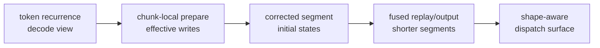

# A Case Study in Agentic Kernel Optimization: Gated DeltaNet Prefill in TileLang

Gated DeltaNet prefill is a useful stress test for AI-assisted kernel work
because it is not just a matrix multiply. It has chunk-local causal work,
recurrent key-value memory, gate decay, delta-rule residual writes, output
replay, final-state production, and shape-sensitive long-context serving.
Prefill wants parallel throughput, but the final state must still match
token-by-token decode.

This case study follows how TileOps turned that operator into a production
prefill path. The final path combines three ingredients:

1. local agentic kernel optimization inside a fixed correctness contract;
2. the CP-split replay schedule family shown by Qwen's FlashQLA project;
3. an expert blocked-inverse / Neumann-style prepare-A producer implemented in
   TileOps.

On the refreshed H200 serving-shape sweep below, the TileOps production
dispatch path is faster than the recorded FLA reference and faster than the
public FlashQLA TL0.1.8 anchor under the documented benchmark contracts. The
FlashQLA comparison is a public-environment comparison, not a controlled
same-lowering attribution experiment.

Benchmark scope:

- Hardware/timer: H200 using the TileOps benchmark infrastructure and archived
  kernel-timing metadata.
- Reference roles: FLA is a recorded vendored correctness/latency reference;
  FlashQLA is a public TL0.1.8 anchor.
- Claim role: this table supports the production serving-surface claim. It does
  not support same-lowering attribution claims about FlashQLA replay or KKT
  lowering.

| Shape | TileOps production dispatch | Recorded FLA reference | Public FlashQLA TL0.1.8 anchor | TileOps / FLA throughput | TileOps / FlashQLA throughput |
| --- | ---: | ---: | ---: | ---: | ---: |
| `32K/H16` | `0.3723 ms` | `3.7964 ms` | `0.5440 ms` | `10.20x` | `1.46x` public-env |
| `64K/H16` | `0.6951 ms` | `7.9840 ms` | `1.3073 ms` | `11.49x` | `1.88x` public-env |
| `128K/H16` | `1.2284 ms` | `16.3385 ms` | `2.6055 ms` | `13.30x` | `2.12x` public-env |
| `64K/H32` | `1.2238 ms` | `10.2402 ms` | `2.5942 ms` | `8.37x` | `2.12x` public-env |
| `64K/H64` | `2.3085 ms` | `18.9782 ms` | `6.7233 ms` | `8.22x` | `2.91x` public-env |

The FLA row is a recorded vendored reference unless package identity is
explicitly verified; SI records the source and version caveats.

The main lesson is not that an agent magically invented a better GPU kernel.
It is that agentic optimization becomes useful when the problem is made
measurable, the search space is explicit, and every candidate passes through
correctness, benchmark, lowering, and attribution gates. Agents can reconstruct
and refine a measurable search space; expert kernels and human derivations can
reshape it.

Credit boundary:

> FlashQLA supplied the production-grade CP-split replay schedule family.
> TileOps rebuilt, validated, tuned, dispatched, and combined that schedule
> with an owned blocked-inverse A producer and a production dispatch surface.

## 1. The Operator: Recurrent Memory Meets Long Prefill

For one `(batch, head)` stream, a Gated DeltaNet decode step can be viewed as a
recurrent memory update:

```math
\begin{aligned}
q_t, k_t &\in \mathbb{R}^{K}, \\
v_t &\in \mathbb{R}^{V}, \\
g_t, \beta_t &\in \mathbb{R}, \\
H_t &\in \mathbb{R}^{K \times V}.
\end{aligned}
```

The schematic decode intuition is:

```math
\begin{aligned}
w_t &= \beta_t k_t, \\
u_t &= \beta_t v_t, \\
\widehat{u}_t &= \mathrm{read}_s(w_t, H_{t-1}), \\
r_t &= u_t - \mathrm{gate}(\widehat{u}_t), \\
o_t &= \mathrm{read}_s(q_t, H_{t-1})
     + \mathrm{read}_{local}(q_t, k_t, r_t), \\
H_t &= \mathrm{decay}(H_{t-1}) + \mathrm{write}(k_t, r_t).
\end{aligned}
```

The important idea is the residual write. GDN does not simply add
`beta_t * v_t` into memory. It reads what the old memory already predicts
under `k_t`, then writes the remaining information. The gate controls memory
lifetime and coordinate scaling; `beta` controls write strength.

Prefill cannot just run that recurrence token by token. It first groups tokens
into chunks, turns intra-chunk causal dependencies into effective writes, then
replays state across chunks:

```text
q, k, v, g, beta
  -> chunk-local prepare
  -> cross-chunk replay
  -> output + final_state
```

The mental model:



The hard part is the tension between equivalence and parallelism. The operator
must compute the same causal state as decode, but long-context prefill needs to
avoid a single long serial replay chain.

## 2. Measurement: Make Agentic Search Auditable

The work only became productive after the operator had a stable measurement
contract. Each candidate needed four gates:

1. **Correctness gate.** Compare output and final state against the recorded
   FLA reference for the scoped shapes, dtype, input distribution, and
   tolerance.
2. **Benchmark gate.** Use the TileOps benchmark infrastructure and preserve
   metadata: GPU, timer, warmup/repeat/trials, commit, layout, seed, and input
   artifact.
3. **Lowering gate.** Inspect generated code when a claim depends on a
   lower-level schedule property. Source similarity alone is not enough for
   TMA/WGMMA/PTX claims.
4. **Decision log.** Record why a candidate is accepted, rejected, or kept only
   as diagnostic evidence.

How to read the rest:

- the production dispatch sweep is the headline serving result;
- same-input A/replay ablations explain prepare-A and replay/output
  attribution;
- historical local diagnostics explain why a candidate was pursued or rejected;
- public FlashQLA rows are external anchors, not same-lowering attribution;
- rejected rows define search boundaries, not performance claims.

This is the difference between agentic search and free-form code generation.
The agent can propose TileLang rewrites, but every rewrite has to pass through
the same gates.

## 3. Local AKO: Useful Wins And The Wall

This section shows, under the recorded diagnostics, that local agentic kernel
tuning helped but did not reduce the long replay dependency depth.

The first useful local win was scale placement. The recurrence update contains
a per-token gate scale. One expression scales the key side before the matrix
multiply:

```python
k_scaled = k_chunk * exp(g_last - g_i)[:, None]
H += k_scaled.T @ v_new
```

The equivalent expression scales the value side instead:

```python
v_scaled = v_new * exp(g_last - g_i)[:, None]
H += k_chunk.T @ v_scaled
```

The algebra is simple:

```math
\sum_i (s_i k_i)v_i^\top
=
\sum_i k_i(s_i v_i)^\top
```

The kernel effect was not cosmetic. Scaling `k` creates an extra staged key
tile. Scaling `v_new` applies the per-token factor on the value path that
already feeds the state update. Historical component diagnostics improved from
`2.2725 ms` to `1.6277 ms`; those numbers explain the local decision, not a
headline production claim.

The second local lesson was the store path. The prepare subcomponent looks like
a simple GEMM:

```text
w_tile or u_tile = A_tile @ operand_tile
```

But the no-store diagnostic showed that the final global-store path mattered.
The accepted shape routed accumulator fragments through a store-friendly shared
tile before writing global memory:

```python
T.gemm(A_s, operand_s, out_frag)
T.copy(out_frag, out_s)
T.copy(out_s, global_out_tile)
```

That is a typical local-AKO result: the agent did not invent new GDN math, but
it found a data path that preserved the operator and improved the measured
component.

Then local fusion hit a wall. Removing some intermediate stores did not shorten
the replay dependency. A direct-fusion candidate can write fewer global
intermediates and still leave the long recurrence intact:

```text
less materialization != shorter recurrence
```

That failure is useful. It shows where local search stops and where the search
space itself has to change.

## 4. Search-Space Expansion I: FlashQLA CP-Split Replay

FlashQLA's key contribution for this story was the production CP-split replay
schedule. It does not merely fuse output. It first computes valid segment
initial states, then runs fused replay/output over shorter segments.

Without CP split:

```text
h0 -> chunk0 -> chunk1 -> chunk2 -> ... -> chunkN
```

With CP split:

```text
prepare corrected segment starts
  -> segment0 replay/output
  -> segment1 replay/output
  -> segment2 replay/output
```

The segments are not naturally independent. Their initial states must be
corrected so each segment starts from the state it would have seen in the full
causal chain. That is why CP split is a schedule-level change, not just a
local fusion.

The first TileOps-owned CP adaptation was useful as bridge evidence, but it
was not a finished FlashQLA reproduction. The row proved that the schedule idea
could be adapted into TileOps, and it also made the difference between a
schedule idea and a production-quality kernel visible. The main text therefore
uses the later A/replay ablation and production sweep for performance claims;
the intermediate bridge row stays in SI.

## 5. Search-Space Expansion II: Blocked-Inverse / Neumann Prepare

The second search-space expansion came from an expert derivation of the
prepare stage. The useful object is a chunk-local lower-triangular correction
matrix. For a chunk of length `C`, define:

```math
M_{i,j} =
\begin{cases}
\beta_i \exp(g_i - g_j)\,\langle k_i, k_j\rangle, & i > j, \\
0, & i \le j .
\end{cases}
```

Then the effective writes have the shape:

```math
\begin{aligned}
A &= (I + M)^{-1}, \\
R_K &= \text{beta-scaled keys under the chosen ABI}, \\
R_V &= \text{beta-scaled values under the chosen ABI}, \\
W &= A R_K, \\
U &= A R_V .
\end{aligned}
```

The exact beta/gate placement is ABI-dependent. This formula shows the
operator-level interaction; the production path may split factors between the A
producer and the replay/output kernel.

Why does a lower-triangular solve appear at all? A small three-token sketch is
enough. Suppose the raw write at token `i` is corrected by the residuals from
earlier tokens:

```math
\begin{aligned}
u'_0 &= u_0, \\
u'_1 &= u_1 - M_{1,0}u'_0, \\
u'_2 &= u_2 - M_{2,0}u'_0 - M_{2,1}u'_1 .
\end{aligned}
```

Stacking the corrected writes gives:

```math
(I + M)U' = U,
\qquad
U' = (I + M)^{-1}U .
```

This is not an arbitrary approximation. Because `M` is strictly lower
triangular inside a fixed chunk, it is nilpotent:

```math
M^C = 0,
\qquad
(I + M)^{-1} = I - M + M^2 - M^3 + \cdots + (-1)^{C-1}M^{C-1}.
```

The finite Neumann view exposes a blockable inverse/update structure. In the
production `chunk64, DK=128` path, TileOps splits the chunk into four
16-token blocks. If `B_r = I + M_{r,r}` is the diagonal block and
`L_{r,s} = M_{r,s}` is a lower off-diagonal block, the ideal block recurrence
is:

```math
\begin{aligned}
A_{r,r} &= B_r^{-1}, \\
A_{r,s} &= -B_r^{-1}\sum_{m=s}^{r-1} L_{r,m}A_{m,s}, \quad r > s .
\end{aligned}
```

The arithmetic story is not "fewer FLOPs everywhere." The blocked producer
does more arithmetic than the minimal strictly triangular interaction, but it
exposes the work as regular GEMM-shaped blocks. In the solve/composition tail,
the TileOps blocked shape is about `1.097x` the MAC count of the FlashQLA-style
forward solve/combine tail. The advantage is not magic arithmetic reduction;
it is a more parallel backend-friendly shape. SI gives the full MAC accounting.

The clean prepare-A comparison is shown with the public FlashQLA anchor for
context:

| Row | Prepare-A producer | Replay/output | `64K/H16` latency | Meaning |
| --- | --- | --- | ---: | --- |
| public FlashQLA full | public FlashQLA TL0.1.8 KKT | public FlashQLA TL0.1.8 CP replay | `1.306838 ms` | external baseline |
| FlashQLA-style prepare A + TileOps replay | TL0.1.8-lowering KKT via external launcher | TileOps CP replay | `0.815029 ms` | no-Neumann combined row |
| TileOps prepare A + TileOps replay | blocked-inverse / Neumann-style A | TileOps CP replay | `0.695237 ms` | headline prepare-A comparison |

Three nearby numbers have different meanings:

| Number | Meaning |
| ---: | --- |
| `0.715062 ms` | adapter bridge evidence: the blocked-inverse producer can feed the same CP downstream ABI, but this is not the clean A-producer proof |
| `0.695237 ms` | same-input A-producer ablation: the headline prepare-A comparison in this section |
| `0.692026 ms` / `~0.6951 ms` | production wrapper / refreshed dispatch surface evidence: production context, not the A-producer ablation proof |

Keeping those rows separate is what prevents the A-producer attribution, replay
attribution, and production-dispatch claim from collapsing into one misleading
speedup ladder.

The native current-TL FlashQLA-style KKT producer remains a rejected diagnostic
at `64K/H16`; the no-Neumann row above uses the TL0.1.8-lowering harness.

## 6. Production: From Point Kernel To Dispatch Surface

A fast point kernel is not yet a production kernel. The production question is
whether the mechanism survives shape changes, head-count changes, wrapper
policy, metadata, and dispatch selection.

TileOps productionization included:

- owned BTHD kernels rather than depending on an external FlashQLA call path;
- TileOps' blocked-inverse A producer combined with the CP-split replay
  schedule;
- shape-aware CP parameters such as segment count and `max_local_chunks`;
- H64 dispatch correction;
- correctness validation against the recorded FLA reference;
- benchmark metadata that records the actual dispatch path.

The production-surface table at the top is the main result. The `64K/H16`
algorithm ladder is useful for explanation, but the engineering claim is that
the selected production path passes correctness and stays fast across this
measured serving surface.

## 7. What Kernel Engineers Can Reuse

The most reusable part of this story is not a single TileLang trick. It is the
workflow:

1. **Separate evidence lanes.** A public anchor, a same-input ablation, a
   historical diagnostic, and a production sweep answer different questions.
2. **Treat failed rows as information, not benchmarks.** A failed current-TL
   KKT port explains a boundary; it does not become a performance row.
3. **Inspect lowering when the claim depends on lowering.** Source-level
   similarity is not enough for TMA/WGMMA/PTX claims.
4. **Use agents for local search.** Scale placement, store paths, and small
   fusion candidates are exactly where gated agentic search is useful.
5. **Change the search space deliberately.** CP split came from FlashQLA; the
   blocked-inverse prepare came from expert derivation. Once those ideas
   existed, the agentic loop became useful again.
6. **Benchmark the dispatch surface.** Production kernels are selected by
   shape and policy, not by a single isolated latency number.

The broader lesson is simple: agentic kernel optimization is most credible
when it is auditable. The agent can move quickly, but correctness gates,
benchmark metadata, evidence lanes, and attribution boundaries determine
which results are safe to publish.

## Supporting Information

This article is the publication-oriented case study. It keeps the main path
compact: problem, mechanism, result, and reusable engineering lessons. The
companion technical report,
[`gdn-prefill-ako-technical-report.md`](../reports/gdn-prefill-ako-technical-report.md),
keeps the full evidence ladder, adapter rows, rejected candidates, ABI caveats,
ablation details, and reproduction metadata.

The technical report is the readable evidence report;
[`gdn-prefill-ako-si.md`](../supplement/gdn-prefill-ako-si.md) is the artifact
index and supplementary guardrail file.

The supporting audit trail lives in the SI file, the companion report, and the
archived evidence files:

- formal `64K/H16` rows and historical local diagnostics;
- A/replay cross-ablation and rejected current-TL KKT rows;
- prefix-scan negative result;
- source, ABI, and FLA-version caveats;
- commands and JSONL paths for reproducing headline rows.

Claim boundaries:

1. FlashQLA supplied the CP-split replay schedule family.
2. TileOps-vs-FlashQLA numbers are public-environment comparisons, not
   same-lowering replay attribution experiments.
3. The FLA baseline is a recorded vendored reference unless package identity is
   explicitly verified.
4. The TL0.1.8-lowering FlashQLA-style prepare row is an external-lowering
   harness measurement, not a native current-TL KKT port.
5. The blocked-inverse / Neumann-style formulas describe the implementation
   family and ABI constraints; the materialized `A` is not claimed to equal
   every generic exact/KKT-style producer.
