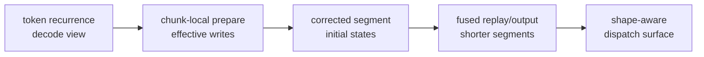

# A Case Study in Agentic Kernel Optimization: Gated DeltaNet Prefill in TileOps with TileLang

Long-context Gated DeltaNet prefill faces a scheduling conflict: fast prefill
needs to process thousands of tokens in parallel, but the operator must still
produce the same recurrent state as sequential decode. That makes it harder
than optimizing a standalone GEMM.

In this case study, TileOps turns that recurrent operator into a scoped
synthetic serving dispatch path. The path has merged into TileOps main via
[PR1596](https://github.com/tile-ai/TileOPs/pull/1596). Under the dependency
contract below, the clean PR1596 merge-commit rerun measured `3.9-6.3x` faster
than the FLA `0.5.1` reference used as the correctness oracle, with a
`1.36-2.68x` public-environment throughput ratio relative to a FlashQLA
TL0.1.8 anchor.

The result should be read less as "an agent invented a kernel" and more as an
auditable optimization loop: fix the operator contract, let agents search local
implementation choices, and require every candidate to pass correctness,
timing, lowering, and attribution gates. The final path combines three
ingredients:

1. local agentic kernel optimization inside a fixed correctness contract;
2. the CP-split replay schedule family shown by Qwen's FlashQLA project:
   compute corrected segment starts, then replay shorter local segments;
3. an expert blocked-inverse / Neumann-style prepare-A producer implemented in
   TileOps.

Key terms:

- **prepare-A**: chunk-local construction of the correction matrix and effective
  writes consumed by replay.
- **replay/output**: the state replay that produces `o` and `final_state`.
- **CP split**: the schedule that first computes corrected segment starts, then
  replays shorter local segments.
- **AKO**: Agentic Kernel Optimization, a gated loop of hypothesis,
  implementation, correctness, benchmark, lowering inspection, and decision
  logging.
- **BTHD**: `[batch, time, heads, dim]`, the serving layout used by the
  headline TileOps path.
- **KKT**: the FlashQLA-style triangular solve / prepare-A producer family used
  as an external-lowering comparison in this article.
- **TL0.1.8**: the TileLang `0.1.8` environment used by the public FlashQLA
  artifact and external-lowering comparison rows.
- **public anchor**: an external baseline measured in its own public
  environment; useful as performance context, but not valid for same-lowering
  attribution claims.
- **same-input ablation**: a controlled comparison that reuses the same input
  artifact and fixes the side of the pipeline not being studied. The A/replay
  ablation in the companion report uses its own exported FlashQLA TL0.1.8
  artifact; that artifact is fixed within the ablation but is not the same file
  as the formal ladder artifact.

Benchmark scope for the headline table:

- Shape/input: synthetic inputs with `B=1`, `DK=DV=128`, `chunk64`, `fp16`,
  BTHD layout; sequence length and head count vary by row.
- Generalization: these rows cover the scoped synthetic serving surface shown
  below. They do not claim coverage of multiple seeds, real model activation
  distributions, other dtypes/layouts, or `B>1`.
- Hardware/timer: H200 using CUPTI kernel-only timing with L2 flush. The
  archived surface rows use `warmup=5`, `repeat=20`, and `trials=3`.
- Dependency contract: TileOps rows use clean PR1596 merge commit
  `79469fc0ddae584537df03e35d935575870574f6`, TileLang `0.1.11`, Torch
  `2.10.0+cu129`, and FLA `0.5.1`.
- Reference roles: FLA `0.5.1` is the correctness/latency reference for this
  clean surface rerun; FlashQLA is a public TL0.1.8 anchor.
- Claim role: this table supports the scoped synthetic serving-surface claim.
  It does not support same-lowering attribution claims about FlashQLA replay or
  KKT lowering. The entire `Throughput ratio vs public FlashQLA anchor` column
  is a public-environment comparison.
- Provenance: these headline TileOps/FLA rows are clean merge-commit reruns
  with `dirty=false` recorded in JSONL. The FlashQLA rows remain public
  external-anchor measurements under their own public environment, with lighter
  provenance metadata than the clean TileOps/FLA rerun.

| Shape | TileOps scoped synthetic dispatch | FLA 0.5.1 reference | Public FlashQLA TL0.1.8 anchor | Speedup vs FLA 0.5.1 | Throughput ratio vs public FlashQLA anchor |
| --- | ---: | ---: | ---: | ---: | ---: |
| `32K/H16` | `0.3990 ms` | `2.1303 ms` | `0.5440 ms` | `5.34x` | `1.36x` |
| `64K/H16` | `0.7498 ms` | `4.2416 ms` | `1.3073 ms` | `5.66x` | `1.74x` |
| `128K/H16` | `1.3404 ms` | `8.4520 ms` | `2.6055 ms` | `6.31x` | `1.94x` |
| `64K/H32` | `1.3193 ms` | `5.4120 ms` | `2.5942 ms` | `4.10x` | `1.97x` |
| `64K/H64` | `2.5086 ms` | `9.8426 ms` | `6.7233 ms` | `3.92x` | `2.68x` |

Source of truth: the table uses the archived
[`TileOps/FLA JSONL`](../evidence/ladder/results/production_surface_tileops_vs_fla_20260709_clean_pr1596_tl011_fla051.jsonl)
and
[`FlashQLA JSONL`](../evidence/ladder/results/production_surface_flashqla_20260701.jsonl).
The evidence-harness code snapshot is archived in
[`evidence/ladder/harness/`](../evidence/ladder/harness/).
PR1596's body contains an earlier concise table under a different archived
benchmark/reference package; the optimized path later merged at commit
`79469fc0ddae584537df03e35d935575870574f6`.

Reference identity: the headline TileOps/FLA rerun imports
`flash-linear-attention==0.5.1`; the package version is recorded in the JSONL.
Older historical diagnostics may still use vendored FLA source snapshots and
are labeled separately in the evidence bundle.

Credit boundary:

> FlashQLA supplied the CP-split replay schedule family.
> TileOps rebuilt, validated, tuned, dispatched, and combined that schedule
> with an owned blocked-inverse A producer and a scoped dispatch surface.

## 1. The Operator: Recurrent Memory Meets Long Prefill

The scheduling tension comes from the operator's recurrent structure. Before
describing the optimization, it helps to see what prefill must preserve from
token-by-token decode.

For one `(batch, head)` stream, a Gated DeltaNet decode step can be viewed as a
recurrent memory update:

```math
\begin{aligned}
q_t, k_t &\in \mathbb{R}^{K}, \\
v_t &\in \mathbb{R}^{V}, \\
g_t, \beta_t &\in \mathbb{R}, \\
H_t &\in \mathbb{R}^{K \times V}.
\end{aligned}
```

The schematic decode intuition is:

```math
\begin{aligned}
w_t &= \beta_t k_t, \\
u_t &= \beta_t v_t, \\
\widehat{u}_t &= \mathrm{read}_s(w_t, H_{t-1}), \\
r_t &= u_t - \mathrm{gate}(\widehat{u}_t), \\
o_t &= \mathrm{read}_s(q_t, H_{t-1})
     + \mathrm{read}_{local}(q_t, k_t, r_t), \\
H_t &= \mathrm{decay}(H_{t-1}) + \mathrm{write}(k_t, r_t).
\end{aligned}
```

The important idea is the residual write. GDN does not simply add
`beta_t * v_t` into memory. It reads what the old memory already predicts
under `k_t`, then writes the remaining information. The gate controls memory
lifetime and coordinate scaling; `beta` controls write strength.

Prefill cannot just run that recurrence token by token. It first groups tokens
into chunks, turns intra-chunk causal dependencies into effective writes, then
replays state across chunks:

```text
q, k, v, g, beta
  -> chunk-local prepare
  -> cross-chunk replay
  -> output + final_state
```

The mental model:



The hard part is the tension between equivalence and parallelism. The operator
must compute the same causal state as decode, but long-context prefill needs to
avoid a single long serial replay chain.

## 2. Measurement: Make Agentic Search Auditable

The work only became productive after the operator had a stable measurement
contract. Each candidate needed four gates:

1. **Correctness gate.** Compare output and final state against the recorded
   FLA reference for the scoped shapes, dtype, input distribution, and
   tolerance. For fp16 rows, the gate uses `torch.allclose` at
   `atol=rtol=5e-2`; `max_abs` and `max_rel` are diagnostics, and large
   relative error near zero is interpreted together with absolute error and
   final-state checks. The gate is intentionally a little wider than the final
   observed errors so AKO candidates can iterate without being rejected by
   harmless fp16 long-recurrence noise. The accepted headline rows are much
   tighter in practice: sampled output `p99_abs` is `6.104e-05`, output
   `max_abs` stays within `0.002502`, output L2 relative error stays within
   `0.003501`, nonfinite counts are zero, final-state sampled `p99_abs` stays
   within `8.757e-05`, and final-state `max_abs` stays within `6.901e-04`.
   This tolerance is scoped to fp16 long-sequence recurrent accumulation and
   requires both output and final-state checks, not only a single output tensor.
2. **Benchmark gate.** Use the TileOps benchmark infrastructure and preserve
   metadata: GPU, timer, warmup/repeat/trials, commit, layout, seed, and input
   artifact.
3. **Lowering gate.** Inspect generated code when a claim depends on a
   lower-level schedule property. Source similarity alone is not enough for
   TMA/WGMMA/PTX claims.
4. **Decision log.** Record why a candidate is accepted, rejected, or kept only
   as diagnostic evidence.

How to read the rest:

- the scoped dispatch sweep is the headline serving result;
- same-input A/replay ablations explain prepare-A and replay/output
  attribution;
- historical local diagnostics explain why a candidate was pursued or rejected;
- public FlashQLA rows are external anchors, not same-lowering attribution;
- rejected rows define search boundaries, not performance claims.

This is the difference between agentic search and free-form code generation.
The agent can propose TileLang rewrites, but every rewrite has to pass through
the same gates.

Representative gated episodes:

| Stage | Agent-assisted action | Human / external input | Accepted evidence | Rejected or bounded evidence | Gate |
| --- | --- | --- | --- | --- | --- |
| Local AKO | Try scale-placement and store-path variants. | Fixed GDN recurrence and output contract. | Scale/store diagnostics kept as local wins. | Direct fusion reached the replay wall. | Correctness + component/full-op latency. |
| CP replay | Adapt the CP-split idea into TileOps. | Qwen FlashQLA schedule family. | TileOps CP bridge and replay ablation. | Bridge rows are not FlashQLA reproduction claims. | Same-input replay + public-environment caveat. |
| Prepare-A | Implement benchmarkable producer variants. | Human blocked-inverse / Neumann derivation. | `0.8245 ms -> 0.7474 ms` same-run prepare-A comparison. | Current-TL KKT nonfinite rows stay diagnostic. | Full-op correctness + A/replay ablation. |

## 3. Local AKO: Useful Wins And The Wall

This section shows, under the recorded diagnostics, that local agentic kernel
tuning helped but did not reduce the long replay dependency depth.

The first useful local win was scale placement. The recurrence update contains
a per-token gate scale. One expression scales the key side before the matrix
multiply:

```python
k_scaled = k_chunk * exp(g_last - g_i)[:, None]
H += k_scaled.T @ v_new
```

The equivalent expression scales the value side instead:

```python
v_scaled = v_new * exp(g_last - g_i)[:, None]
H += k_chunk.T @ v_scaled
```

The algebra is simple:

```math
\sum_i (s_i k_i)v_i^\top
=
\sum_i k_i(s_i v_i)^\top
```

The kernel effect was not cosmetic. Scaling `k` creates an extra staged key
tile. Scaling `v_new` applies the per-token factor on the value path that
already feeds the state update. Historical component diagnostics improved from
`2.2725 ms` to `1.6277 ms`; those numbers explain the local decision, not a
headline scoped-surface claim.

The second local lesson was the store path. The prepare subcomponent looks like
a simple GEMM:

```text
w_tile or u_tile = A_tile @ operand_tile
```

But the no-store diagnostic showed that the final global-store path mattered.
The accepted shape routed accumulator fragments through a store-friendly shared
tile before writing global memory:

```python
T.gemm(A_s, operand_s, out_frag)
T.copy(out_frag, out_s)
T.copy(out_s, global_out_tile)
```

That is a typical result from local agentic kernel optimization (AKO): the
agent did not invent new GDN math, but it found a data path that preserved the
operator and improved the measured component.

Then local fusion hit a wall. Removing some intermediate stores did not shorten
the replay dependency. A direct-fusion candidate can write fewer global
intermediates and still leave the long recurrence intact:

```text
less materialization != shorter recurrence
```

That failure is useful. It shows where local search stops and where the search
space itself has to change. The next two sections describe the two external
inputs that changed it.

## 4. Search-Space Expansion I: FlashQLA CP-Split Replay

FlashQLA's key contribution for this story was the production CP-split replay
schedule. It does not merely fuse output. It first computes valid segment
initial states, then runs fused replay/output over shorter segments.

Without CP split:

```text
h0 -> chunk0 -> chunk1 -> chunk2 -> ... -> chunkN
```

With CP split:

```text
prepare corrected segment starts
  -> segment0 replay/output
  -> segment1 replay/output
  -> segment2 replay/output
```

Conceptually, the schedule looks like:

```python
# serial replay has one dependency chain over all chunks
h = h0
for chunk in chunks:
    o[chunk], h = replay_output(chunk, h)

# CP split moves part of causality into segment-start correction
h_start = correct_segment_starts(segment_summaries, h0)
for segment in segments:  # independent once h_start is known
    h = h_start[segment]
    for chunk in segment:  # short local recurrence
        o[chunk], h = fused_replay_output(chunk, h)
```

The segments are not naturally independent. Their initial states must be
corrected so each segment starts from the state it would have seen in the full
causal chain. That is why CP split is a schedule-level change, not just a
local fusion: it does not remove causality, but it changes where the long
dependency is paid. The replay/output path now sees short local chains instead
of one chain over all chunks, while the segment-start correction carries the
cross-segment dependency.

The first TileOps-owned CP adaptation was useful as bridge evidence, but it
was not a finished FlashQLA reproduction. The row provided bridge evidence that
the schedule idea could be adapted into TileOps, and it also made the difference
between a schedule idea and a production-quality kernel visible. The main text
therefore uses the later A/replay ablation and production sweep for performance
claims; the intermediate bridge row stays in SI.

## 5. Search-Space Expansion II: Blocked-Inverse / Neumann Prepare

The second search-space expansion came from an expert derivation of the
prepare stage. The useful object is a chunk-local lower-triangular correction
matrix. Here ABI means the producer/replay tensor contract: which side owns
beta/gate factors, layout, and chunk-local `g_cum`. Under the implementation
convention used in this article, one useful logical view for a chunk of length
`C` is:

```math
M_{i,j} =
\begin{cases}
\beta_i \exp(g_i - g_j)\,\langle k_i, k_j\rangle, & i > j, \\
0, & i \le j .
\end{cases}
```

Then the effective writes have the shape:

```math
\begin{aligned}
A &= (I + M)^{-1}, \\
R_K &= \text{ABI-scaled keys}, \\
R_V &= \text{ABI-scaled values}, \\
W &= A R_K, \\
U &= A R_V .
\end{aligned}
```

The exact beta/gate placement is ABI-dependent. This formula shows the
operator-level interaction; the production path may split factors between the A
producer and the replay/output kernel. In the headline CP dispatch path, the
materialized `A` is not a complete gate-folded logical `A`: TileOps constructs
it with a `g_zero` convention and passes chunk-local `g_cum` separately into
replay.

The beta index is also convention-dependent. Some derivations place the write
strength on the earlier token or fold it into the key/value write tensors. These
placements are not all applied simultaneously. This article uses the
implementation-scoped convention above and treats the remaining factor placement
as part of the A-producer / replay ABI.

Why does a lower-triangular solve appear at all? A small three-token sketch is
enough. Suppose the raw write at token `i` is corrected by the residuals from
earlier tokens:

```math
\begin{aligned}
u'_0 &= u_0, \\
u'_1 &= u_1 - M_{1,0}u'_0, \\
u'_2 &= u_2 - M_{2,0}u'_0 - M_{2,1}u'_1 .
\end{aligned}
```

Stacking the corrected writes gives:

```math
(I + M)U' = U,
\qquad
U' = (I + M)^{-1}U .
```

This is not an arbitrary approximation. Because `M` is strictly lower
triangular inside a fixed chunk, it is nilpotent:

```math
M^C = 0,
\qquad
(I + M)^{-1} = I - M + M^2 - M^3 + \cdots + (-1)^{C-1}M^{C-1}.
```

The finite Neumann view exposes a blockable inverse/update structure. In the
production `chunk64, DK=128` path, TileOps splits the chunk into four
16-token blocks. If `B_r = I + M_{r,r}` is the diagonal block and
`L_{r,s} = M_{r,s}` is a lower off-diagonal block, the ideal block recurrence
is:

```math
\begin{aligned}
A_{r,r} &= B_r^{-1}, \\
A_{r,s} &= -B_r^{-1}\sum_{m=s}^{r-1} L_{r,m}A_{m,s}, \quad r > s .
\end{aligned}
```

The arithmetic story is not "fewer FLOPs everywhere." The blocked producer
does more arithmetic than the minimal strictly triangular interaction, but it
exposes the work as regular GEMM-shaped blocks. In the solve/composition tail,
the TileOps blocked shape is about `1.097x` the MAC count of the FlashQLA-style
forward solve/combine tail. The advantage is not magic arithmetic reduction;
it is a more parallel backend-friendly shape. The win is therefore a scheduling
and backend-shape win, not a claim that the mathematical operator became cheaper
in the abstract. SI gives the full MAC accounting.

The prepare-A claim rests on the following same-shape context rows. The public
FlashQLA row is external context; the attribution comparison is the two
TileOps-replay rows. The middle row uses the FlashQLA TL0.1.8-lowered KKT
producer through an external launcher, then feeds its produced `A/g` tensors
into the TileOps PR1596 replay path. It is not a native current-TileLang KKT
port and not a direct call to the full FlashQLA forward path. This A/replay
ablation in the companion report uses the exported public TL0.1.8 artifact as
its fixed reference context; the headline surface correctness gate uses FLA
`0.5.1`.

| Row | Prepare-A producer | Replay/output | `64K/H16` latency | Meaning |
| --- | --- | --- | ---: | --- |
| public FlashQLA full | public FlashQLA TL0.1.8 KKT | public FlashQLA TL0.1.8 CP replay | `1.306838 ms` | external baseline |
| FlashQLA-style prepare A + TileOps replay | TL0.1.8-lowered KKT producer via external launcher | TileOps CP replay | `0.8245 ms` | refreshed no-Neumann combined row |
| TileOps prepare A + TileOps replay | blocked-inverse / Neumann-style A | TileOps CP replay | `0.7474 ms` | refreshed same-run Neumann combined row |

Nearby wrapper and bridge numbers are separated in the SI so the A-producer
attribution, replay attribution, and scoped-dispatch claim do not collapse into
one misleading speedup ladder.

### Final Attribution Split

To separate replay/output from prepare-A, the evidence package also runs
TileOps replay on exported public FlashQLA `A/g` artifacts. That combination is
not a full TileOps op, but it isolates the replay/output side of the schedule
under a shared artifact. This is why the replay number below is lower than the
`0.8245 ms` full row above: `0.542807 ms` is TileOps replay on an already
exported FlashQLA `A/g` artifact, while `0.8245 ms` includes producing the
TL0.1.8-lowered KKT `A/g` plus the TileOps replay path. In the corresponding
full-row breakdown, cached-`A/g` TileOps replay is `0.542159 ms`.

The attribution split is:

| Axis | Evidence | Meaning |
| --- | --- | --- |
| CP-split schedule | FlashQLA source and public anchor | FlashQLA supplied the schedule family that breaks the long replay wall. |
| Replay/output implementation | replay-only: exported public FlashQLA `A/g` + TileOps replay: `0.542807 ms`; public FlashQLA replay anchor: `0.860569 ms` | TileOps replay/output contributes an independent speedup under this benchmark method. |
| Prepare-A producer | FlashQLA-style prepare + TileOps replay: `0.8245 ms`; TileOps prepare + TileOps replay: `0.7474 ms` | blocked-inverse / Neumann-style prepare improves the same replay family in the refreshed same-run measurement. |

The native current-TL FlashQLA-style KKT producer remains a rejected diagnostic
at `64K/H16`; the no-Neumann row above uses the TL0.1.8-lowering harness.

## 6. Production: From Point Kernel To Scoped Dispatch Surface

A fast point kernel is not yet enough for a scoped serving path. The production
question here is whether the mechanism survives shape changes, head-count
changes, wrapper policy, metadata, and dispatch selection inside the documented
TileOps GDN prefill contract.

TileOps productionization included:

- owned BTHD kernels rather than depending on an external FlashQLA call path;
- TileOps' blocked-inverse A producer combined with the CP-split replay
  schedule;
- shape-aware CP parameters such as segment count and `max_local_chunks`;
- H64 dispatch correction;
- correctness validation against the recorded FLA reference;
- benchmark metadata that records the actual dispatch path.

The scoped-surface table at the top is the main result. The `64K/H16`
algorithm ladder is useful for explanation, but the engineering claim is that
the selected scoped serving path passes correctness and stays fast across this
measured surface.

## 7. What Kernel Engineers Can Reuse

The publishable unit is not an agent-generated kernel. It is an auditable
optimization loop: fixed correctness contract, reproducible benchmark metadata,
explicit attribution lanes, and clear credit boundaries.

The reusable workflow has six parts:

1. **Separate evidence lanes.** A public anchor, a same-input ablation, a
   historical diagnostic, and a production sweep answer different questions.
2. **Treat failed rows as information, not benchmarks.** A failed current-TL
   KKT port explains a boundary; it does not become a performance row.
3. **Inspect lowering when the claim depends on lowering.** Source-level
   similarity is not enough for TMA/WGMMA/PTX claims.
4. **Use agents for local search.** Scale placement, store paths, and small
   fusion candidates are exactly where gated agentic search is useful.
5. **Change the search space deliberately.** CP split came from FlashQLA; the
   blocked-inverse prepare came from expert derivation. Once those ideas
   existed, the agentic loop became useful again.
6. **Benchmark the dispatch surface.** Serving kernels are selected by shape and
   policy, not by a single isolated latency number.

The broader lesson returns to the opening scheduling conflict. Agents can move
quickly inside a measured search space, but correctness gates, benchmark
metadata, evidence lanes, and attribution boundaries determine which results
are safe to publish.

## References

- [QwenLM FlashQLA](https://github.com/QwenLM/FlashQLA)
- [Gated Delta Networks](https://arxiv.org/abs/2412.06464)
- [NVlabs GatedDeltaNet implementation](https://github.com/NVlabs/GatedDeltaNet)
- [TileLang documentation](https://tilelang.com/)

## Supporting Information

This article is the publication-oriented case study. It keeps the main path
compact: problem, mechanism, result, and reusable engineering lessons. The
companion technical report,
[`gdn-prefill-ako-technical-report.md`](../reports/gdn-prefill-ako-technical-report.md),
keeps the full evidence ladder, adapter rows, rejected candidates, ABI caveats,
ablation details, and reproduction metadata.

The technical report is the readable evidence report;
[`gdn-prefill-ako-si.md`](../supplement/gdn-prefill-ako-si.md) is the artifact
index and supplementary guardrail file.

The supporting audit trail lives in the SI file, the companion report, and the
archived evidence files:

- formal `64K/H16` rows and historical local diagnostics;
- A/replay cross-ablation and rejected current-TL KKT rows;
- prefix-scan negative result;
- source, ABI, and FLA-version caveats;
- commands and JSONL paths for reproducing headline rows.

Claim boundaries:

1. FlashQLA supplied the CP-split replay schedule family.
2. TileOps-vs-FlashQLA numbers are public-environment comparisons, not
   same-lowering replay attribution experiments.
3. The headline FLA baseline is `flash-linear-attention==0.5.1`; older
   diagnostics that use vendored FLA snapshots keep their own caveats.
4. The TL0.1.8-lowering FlashQLA-style prepare row is an external-lowering
   harness measurement, not a native current-TL KKT port.
5. The blocked-inverse / Neumann-style formulas describe the implementation
   family and ABI constraints; the materialized `A` is not claimed to equal
   every generic exact/KKT-style producer.
