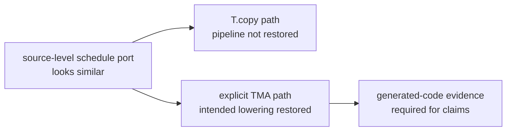
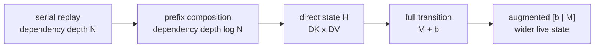

# Supporting Information For The GDN Prefill AKO Case Study

This supporting information keeps the detailed evidence, caveats, and negative
results behind
[`gdn-prefill-ako-case-study.md`](../articles/gdn-prefill-ako-case-study.md).
The main article cites this file when it needs evidence detail without inlining
every table.

## SI. Guardrails, Evidence Snapshot, And Supplementary Analyses

This file separates support evidence from headline evidence. Migration lessons,
prefix-scan negative results, formal `64K/H16` rows, source caveats, and
reproduction guardrails live here so the main story can stay compact without
overclaiming.

The main path is now clear: FlashQLA supplied the CP-split replay schedule,
human analysis supplied the stronger A producer shape, and TileOps turned that
combination into an owned production path. Two side lessons are still worth
keeping, but they belong after the main path because they are guardrails rather
than the spine of the story.

Code status: the production path discussed by the main article entered TileOps
main through [tile-ai/TileOps#1596](https://github.com/tile-ai/TileOPs/pull/1596),
merge commit `79469fc0ddae584537df03e35d935575870574f6`. Some archived JSONL
rows below still record the pre-merge PR worktree path because that is where the
benchmark artifacts were collected.

### SI.1 Source Similarity Is Not Performance Equality

Studying FlashQLA was a source-level adaptation of a schedule idea, not a
direct wrapper around the upstream kernel. The first question was whether a
source-level CP-split schedule port preserved the same lowering behavior in the
current TileOps TileLang environment. It did not always do so automatically.

In the migration experiments, one source-equivalent shape failed to recover
the intended TMA-specialized path:

```python
# TileLang-shaped pseudocode.
T.copy(global_tile, shared_tile)
```

The restored path needed explicit TMA-shaped movement and generated-code
inspection:

```python
# TileLang-shaped pseudocode.
T.tma_copy(global_tile, shared_tile, barrier=barrier)
T.wait_tma_barrier(barrier)  # pseudocode

lowering = inspect_generated_cuda(kernel)
assert lowering.contains_expected_tma_path
```

Figure 11 shows the lesson.



This is why the article must not claim TMA, WGMMA, or PTX/SASS behavior unless
the generated code has actually been inspected and archived. Source-level
similarity is a hypothesis; lowering evidence decides whether it is true.

Evidence shape:

| Candidate | Evidence | Scope |
| --- | --- | --- |
| source-equivalent `T.copy` migration | did not recover the intended TMA-specialized path in migration experiments | migration diagnostic |
| explicit `T.tma_copy(..., barrier=...)` path | generated-code inspection showed the intended TMA path | migration diagnostic |

### SI.2 Prefix Scan Was Valid But Too Heavy For This Shape

Before and after studying FlashQLA, we also explored whether replay could be
parallelized through grouped transition composition or butterfly/prefix scan.
The mathematical idea is sound. A group of chunks can be viewed schematically
as an affine transition:

```text
T(H) = M H + b
```

and transitions compose associatively:

```text
T2(T1(H)) = (M2 M1) H + (M2 b1 + b2)
```

That reduces dependency depth in principle. But the representation is much
heavier than the direct state:

```text
direct state:       H     has shape DK x DV
full transition:    M, b  have shape DK x DK and DK x DV
augmented summary:  [b | M] has width DV + DK
```

Figure 12 presents the tradeoff as two side-by-side panels: dependency depth on
the left and representation cost on the right.



This rejects the tested full `[b | M]` transition representation for the
current `DK=DV=128`, `chunk64` production path, not a general claim that
prefix scan cannot work for GDN.

The experiments validated the affine view, but every production-shaped
insertion paid extra recurrence, summary, or output-correction cost. A future
narrower transition representation or different pipeline could still make a
prefix idea useful. For the current production path, the CP-split schedule was
the better engineering choice.

Historical negative-result evidence:

This block is retained as dated diagnostic context. It is not used for headline
performance claims.

| Candidate family | Result | Scope |
| --- | --- | --- |
| per-chunk `M @ H + b` transition application | correct but about `1.5x` slower | historical component diagnostic |
| fused direct replay + full summary | correct but about `2.2x` slower on `64K/H16` | historical negative result |
| full `[b | M]` group sweep | `group_chunks=2/4/8/16` did not rescue the representation | historical negative result |

### SI.3 Formal `64K/H16` Evidence Snapshot

This section is the first formal evidence package for the rewrite, not the
complete publication table. It refreshes the main evidence table for one scoped
serving shape:

```text
B=1, T=65536, H=16, DK=DV=128, chunk64, fp16, BTHD
GPU: H200 / GPU4
timer: CUPTI kernel-only with CUDA-event fallback, warmup 10, repeat 50, trials 3
input hash: sha256:a8987a2c6d16c658a1cb8ed95e409d973a3f736e2019d8719b143f18b4741513
```

The evidence has three lanes:

| Lane | What it can support |
| --- | --- |
| Experiment-adapter rows | Full-op comparison inside TileOps experiment adapters under the same input artifact and correctness reference. |
| External/final anchors | FLA reference and production dispatch context. These rows are useful, but not experiment-adapter steps. |
| Source / ABI caveats | The limits on what intermediate equality and version claims can say. |

#### SI.3.1 Experiment-Adapter Rows

These rows are publication-eligible evidence rows and are marked
`causal_ladder_eligible=true` in the harness output. That field name means they
are allowed into the controlled experiment table; it does not mean every row is
a headline narrative milestone. In particular, V5 is an intermediate
FlashQLA-learning row used to hold the downstream ABI fixed for the V5/V6
bridge comparison. All rows pass correctness against the same recorded
vendored FLA reference.

| Role | Variant | Blog meaning | `64K/H16` latency | Speedup vs previous | Perf vs recorded FLA (%) |
| --- | --- | --- | ---: | ---: | ---: |
| baseline | `generic_a_legacy` | current-repo generic A producer plus legacy replay/output baseline | `11.1906 ms` | `1.00x` | `71.7%` |
| first CP adaptation | `tileops_owned_cp_generic_a` | early CP-downstream bridge with a conservative generic A producer; useful control row, not a headline FlashQLA result | `2.7674 ms` | `4.04x` | `290.0%` |
| producer-swap adapter | `tileops_owned_cp_blocked_inverse_a` | same CP downstream ABI, blocked-inverse / Neumann-style blocksolve A producer | `0.715062 ms` | `3.87x` | `1122.4%` |

The end-to-end speedup across these experiment adapters is:

```text
11.1906 ms / 0.715062 ms = 15.65x
```

The experiment-adapter chain is:

```text
generic_a_legacy
  -> tileops_owned_cp_generic_a
  -> tileops_owned_cp_blocked_inverse_a
```

The V5 row is the first correct TileOps-owned adaptation after studying
FlashQLA. It moved into the CP-split downstream structure, but the conservative
generic A producer and mixed bridge implementation kept the full-op latency far
from FlashQLA. That is useful evidence: it shows the gap between adopting a
schedule idea and reproducing a finished kernel.

The V5/V6 jump is supporting bridge evidence under the same downstream
contract: replacing the conservative generic A producer with the
blocked-inverse / Neumann-style A producer gives the faster V6 adapter row.
This is not the main Neumann prepare causal proof and not a pure ablation of the
math alone; the cleaner A-producer evidence is the A/replay cross-ablation.

The FlashQLA-alignment node is not V5. It is the A/replay cross-ablation:
TL0.1.8 lowered FlashQLA KKT injected through an external launcher plus
TileOps replay gives a measured `0.815029 ms` full path, faster than refreshed
public FlashQLA full `1.306838 ms`; then TileOps blocksolve A plus the same
replay family gives `0.695237 ms` in the clean Section 11 same-input row.

This experiment-adapter table alone is not the complete FlashQLA attribution
story. The A/replay cross-ablation below adds the missing split: with
public FlashQLA TL0.1.8 `A/g` fixed, TileOps replay reaches `0.542807 ms`; with
the TL0.1.8-lowering external prepare row, cached TileOps replay is
`0.542159 ms`; and the public FlashQLA replay anchor is `0.860569 ms`. That
means the final story is not only "CP-split plus better A." On this tested
shape, the TileOps-owned replay/output implementation also contributes an
independent speedup. V5 is not a one-to-one FlashQLA reproduction; it is a
generic-A bridge row rather than a public FlashQLA row.

Nearby numbers that appear in the article and evidence package have different
meanings:

| Number | Evidence lane | Meaning |
| ---: | --- | --- |
| `0.715062 ms` | adapter bridge | compatibility evidence under the same CP downstream ABI |
| `0.695237 ms` | same-input A-producer ablation | headline Neumann prepare comparison |
| `0.692026 ms` / `~0.6951 ms` | production wrapper / surface sweep | production-context evidence, not the ablation proof |

#### SI.3.2 External And Final Anchors

These rows are not mixed into the experiment-adapter rows. The `64K/H16`
dispatch row is still useful as an anchor, but the broader production-surface
sweep is the production claim.

| Variant | Role | `64K/H16` latency | Correctness | Use in blog |
| --- | --- | ---: | --- | --- |
| `ref_fla_051` | recorded vendored FLA reference baseline | `8.02574 ms` | self/reference row | correctness oracle and FLA latency context, with version caveat |
| `tileops_final_dispatch` | merged PR1596 production wrapper / dispatch context | `0.692026 ms` historical anchor; `0.6951 ms` in the refreshed surface sweep | pass vs recorded FLA reference | production-surface row family, not an experiment-adapter step |

Write `tileops_final_dispatch` as a production wrapper / dispatch-context
observation, not as an additional algorithmic improvement after the
blocked-inverse A producer. The historical single-shape wrapper delta is kept in
the evidence note; the stronger main-text statement is the refreshed shape
sweep:
`evidence/ladder/results/production_surface_tileops_vs_fla_20260701.jsonl`
plus the public FlashQLA TL0.1.8 sweep:
`evidence/ladder/results/production_surface_flashqla_20260701.jsonl`.

FlashQLA remains the public schedule and performance reference. The refreshed
public FlashQLA TL0.1.8 surface sweep includes `1.3073 ms` for the same
`64K/H16` shape, with `0.8628 ms` replay-only and `0.4712 ms` prepare
components. It must stay in
the public-environment comparison lane:

```text
TileOps vs FlashQLA is a public-environment comparison, not a controlled
same-lowering replay attribution experiment.
```

#### SI.3.3 Source, ABI, And Correctness Caveats

The formal evidence package is clean enough for the scoped blog claim, but it
has bounded claim scope.

| Pair / row | ABI/source fact | Evidence |
| --- | --- | --- |
| `tileops_owned_cp_generic_a` | experiment adapter using current-repo generic A producer plus PR1596 CP downstream | generic A module `fused_prepare_compute_w_u.py`; CP downstream module `gdn_prefill/fused_fwd.py`; `used_code_root.kind=mixed_experiment_roots` |
| `tileops_owned_cp_blocked_inverse_a` | experiment adapter using PR1596 blocked-inverse / blocksolve A producer plus the same PR1596 CP downstream | blocksolve producer module `gated_deltanet_prefill.py`; CP downstream module `gdn_prefill/fused_fwd.py`; `used_code_root.kind=production_root_experiment_adapter` |
| V5/V6 A comparison | same materialized A handoff shape/layout, different producer math / numerics | `A allclose=false`, `max_abs=0.117279`, V5 `max_rel=20583.9`, V6 `max_rel=29546.4` |
| V6 adapter | explicit experiment row, not the production dispatch wrapper | `uses_production_dispatch_wrapper=false` |
| final dispatch | production wrapper merged through PR1596 | `uses_production_dispatch_wrapper=true` |

Safe wording:

```text
V5 and V6 use the same CP downstream ABI and materialized A handoff
shape/layout, but they use different A producers. Both rows are full-op
correct against the recorded FLA reference.
```

Do not write:

```text
V5 and V6 have numerically equivalent A tensors.
```

The FLA reference also needs a caveat. All formal rows record:

```text
reference_version_verified=false
version_status=unverified_commit_based_reference
vendor_commit_file=91d2f468944842ab2d947350d280ca1db793db57
```

This does not invalidate the TileOps experiment-adapter rows because
all rows use the same recorded reference and same input artifact for
correctness. External FLA claims use "recorded vendored FLA reference" unless
the package identity is independently verified.

#### SI.3.4 A/Replay Cross-Ablation

The first formal experiment-adapter table still left a real ambiguity: if
TileOps learned the FlashQLA CP-split schedule, why did the generic-A CP row not
land near FlashQLA, and why did the final TileOps row later exceed FlashQLA?

The follow-up cross-ablation answers that more cleanly. It exports public
FlashQLA TL0.1.8 tensors, including `A`, `g_cum`, `o`, and `final_state`, and
then runs TileOps replay on the same `A/g` artifact.

Evidence notes:
[`section11_a_producer_ablation_64k_h16.md`](../evidence/ladder/summaries/section11_a_producer_ablation_64k_h16.md)
and
[`a_replay_cross_ablation_64k_h16.md`](../evidence/ladder/summaries/a_replay_cross_ablation_64k_h16.md).
The full external-lowering and Neumann rows use
`benchmarks.benchmark_base.bench_kernel`. The machine-readable evidence is
split across the archived Section 11 JSONL files listed in SI.3.7 rather than a
single combined JSONL file.

| Row | A producer | Replay/output path | Timing scope | Correctness reference | Latency |
| --- | --- | --- | --- | --- | ---: |
| `FQ/FQ` | public FlashQLA TL0.1.8 KKT | public FlashQLA TL0.1.8 CP replay | full public op | public FlashQLA self row | `1.306838 ms` |
| `FQ/FQ producer` | public FlashQLA TL0.1.8 KKT | producer-only row | `chunk_local_cumsum + kkt_solve` | component timing only | `0.471233 ms` |
| `FQ/FQ replay` | exported public FlashQLA A/g | public FlashQLA TL0.1.8 CP replay | `cp_preprocess + fused_gdr_fwd` | component timing only | `0.860569 ms` |
| `TL018-lowering/TO full` | TL0.1.8 lowered KKT via external launcher | TileOps PR1596 CP replay | full combined row | public TL0.1.8 artifact | `0.815029 ms` |
| `TL018-lowering/TO prepare` | TL0.1.8 lowered KKT via external launcher | producer-only row | current `chunk_local_cumsum` + external `kkt_solve` | exact `A/g` vs public artifact | `0.470905 ms` |
| `TL018-lowering/TO replay` | produced TL0.1.8-lowering A/g | TileOps PR1596 CP replay | replay-only | public TL0.1.8 artifact | `0.542159 ms` |
| `FQ18/TO` | exported public FlashQLA TL0.1.8 A/g | TileOps PR1596 CP replay | replay-only | recorded vendored FLA reference | `0.542807 ms` |
| `TO/TO replay` | TileOps blocksolve A | TileOps PR1596 CP replay | replay-only | recorded vendored FLA reference | `0.542905 ms` |
| `TO/TO full` | TileOps blocksolve A | TileOps PR1596 CP replay | include producers | public TL0.1.8 artifact | `0.695237 ms` |

This changes the explanation. V5 is not a faithful FlashQLA reproduction. It is
a controlled bridge row that keeps a conservative generic A producer while
moving into the TileOps-owned CP downstream ABI. That is why it can be useful in
the adapter table without being performance-near FlashQLA.

The degradation is part of the evidence, not a result to hide. Together with
the mixed TileOps-owned implementation path and conservative generic A producer,
it shows that the agent was learning and adapting an external schedule idea
inside TileOps rather than reproducing a finished FlashQLA kernel.

The replay side does show an independent improvement. Holding public FlashQLA
`A/g` fixed, TileOps replay is faster than public FlashQLA replay:

```text
0.860569 ms / 0.542159 ms = 1.59x
```

The same TileOps replay latency appears with public FlashQLA `A/g` and with
TileOps `A/g`:

```text
FQ18 A + TileOps replay: 0.542807 ms
TL0.1.8-lowering A + TileOps replay: 0.542159 ms
TileOps A + TileOps replay: 0.542905 ms
```

So the replay/output improvement is not merely a side effect of changing the A
producer.

The A producer still matters. Under the TileOps benchmark harness, the measured
TL0.1.8-lowering prepare row is essentially tied with, and very slightly faster
than, the refreshed public FlashQLA producer component:

```text
0.471233 ms / 0.470905 ms = 1.0007x
```

The measured TL0.1.8-lowering full path is faster than public FlashQLA full
path, but slower than the same-input TileOps full row:

```text
1.306838 ms / 0.815029 ms = 1.60x
0.815029 ms / 0.695237 ms = 1.17x
```

That row is a measured single host-process path, but it is still an
external-lowering harness row rather than a production TileOps API row. It
is named precisely as TL0.1.8 lowered FlashQLA KKT via external launcher plus
unchanged TileOps PR1596 replay.

This is also why the `2.7674 ms -> 0.715062 ms` adapter jump is not the main
A-producer proof. The cleaner ablation is:

```text
TL0.1.8-lowering prepare + TileOps replay: 0.815029 ms
TileOps blocksolve producer + TileOps replay:       0.695237 ms
```

We also tried the native current-TL measured combined row:

```text
current-TL FlashQLA-style KKT producer + TileOps replay
```

That row is measurable but not correct at `64K/H16`: `default`, `legacy`, and
`wgmma` GEMM compatibility modes all produced nonfinite outputs. The failure is
localized to the current-TL KKT producer, since `g_cum` matches the TL0.1.8
artifact while the current-TL `A` contains nonfinite/extreme values. Therefore
the measured combined row is a rejected diagnostic, not a performance point.
The passing July 1 row uses the TL0.1.8 lowered KKT binary/lowering through an
external launcher. The native current-TL port is still rejected, but the strict
publication state for the no-Neumann combined row is now measured.

The supported narrative is therefore:

```text
FlashQLA supplied the production-grade CP-split schedule family.
TileOps improved two implementation axes under that schedule family:
  1. the replay/output implementation;
  2. the A producer via the blocked-inverse / Neumann-style path.
```

#### SI.3.4.1 Prepare-A MAC Accounting

The main article counts one multiply-add as one MAC and scopes the accounting
to the prepare-A producer, not the entire GDN prefill operator. For the
production `chunk64, DK=128` blocksolve producer, each chunk/head is split into
four 16-token blocks.

The Gram stage computes the ten lower-block products:

```text
G00
G10, G11
G20, G21, G22
G30, G31, G32, G33
```

Each product is a `16 x 128` by `128 x 16` multiply:

```text
one Gram block = 16 * 16 * 128 = 32,768 MACs
ten blocks     = 10 * 32,768   = 327,680 MACs
```

For comparison, a full dense `64 x 64` Gram would be:

```text
64 * 64 * 128 = 524,288 MACs
```

The strict causal off-diagonal interaction would be:

```text
(64 * 63 / 2) * 128 = 258,048 MACs
```

If the diagonal is counted as part of a lower-triangular Gram reference, the
count becomes:

```text
(64 * 65 / 2) * 128 = 266,240 MACs
```

The blocked implementation intentionally sits between those two counts: it
avoids the upper off-diagonal blocks, but computes dense `16 x 16` diagonal
blocks to keep a regular GEMM shape.

The block inverse/composition tail uses twenty-four `16 x 16 x 16` small GEMMs:

```text
diagonal local updates:        8 GEMMs
off-diagonal block composition: 16 GEMMs
one small GEMM = 16 * 16 * 16 = 4,096 MACs
total tail     = 24 * 4,096   = 98,304 MACs
```

So the prepare-A producer performs:

```text
327,680 + 98,304 = 425,984 GEMM MACs per chunk/head
```

For the formal `B=1, T=65536, H=16, chunk64` evidence row:

```text
chunk/heads = (65536 / 64) * 16 = 16,384
prepare-A GEMM MACs = 425,984 * 16,384 = 6,979,321,856
```

This excludes scalar beta/gate exponent and scaling work, stores, and the
downstream replay/output kernel. Under the usual FLOP convention where one
multiply-add is counted as two FLOPs, double the MAC counts.

For the forward-vs-Neumann question, ignore the interaction-construction stage
and compare only the solve/combine tail. The FlashQLA TL0.1.8 `kkt_solve`
source-level forward hierarchy has:

```text
4 diagonal 16x16 forward solves
                 = 4 * 16 * sum_{s=1}^{15} s = 7,680 MACs
first 16-block combine level
                 = 2 passes * 2 blocks * 16^3 = 16,384 MACs
second 32-block combine level
                 = 2 * 32^3 = 65,536 MACs
FlashQLA forward solve/combine tail
                 = 7,680 + 16,384 + 65,536
                 = 89,600 MACs per chunk/head
```

The TileOps blocked-inverse / Neumann-style tail uses twenty-four
`16 x 16 x 16` small GEMMs:

```text
TileOps blocksolve tail = 24 * 16^3 = 98,304 MACs per chunk/head
```

So, for the inversion strategy alone, the Neumann-style blocked tail does about
`8,704` more MACs per chunk/head, or about `9.7%` more tail arithmetic:

```text
98,304 / 89,600 = 1.097x
```

For `B=1, T=65536, H=16, chunk64`, the same tail-only comparison is:

```text
FlashQLA forward solve/combine tail: 1,468,006,400 MACs
TileOps blocksolve tail:             1,610,612,736 MACs
```

This comparison is source-level arithmetic accounting, not a generated-SASS
instruction count. The Neumann-style tail spends slightly more arithmetic than
the forward hierarchy, but exposes the work as a fixed sequence of small block
GEMMs. This tail-only comparison does not support claims about the full
prepare-A producer, because interaction construction is a separate stage.

#### SI.3.5 Evidence Refresh Conditions

The formal `64K/H16` package and the five-shape production-surface sweep replace
the old mixed historical speed ladder as the main evidence spine. They still
need to be refreshed if the benchmark contract changes:

| Refresh / verification item | Why it matters |
| --- | --- |
| production-surface sweep refresh | rerun if TileOps main/release commit, TileLang wheel, docker/runtime, dispatch heuristic, benchmark timer, GPU, or FlashQLA/FLA environment changes |
| generated-code archive for TMA/WGMMA claims | needed before making low-level lowering claims |
| verified FLA package identity | needed before saying externally verified FLA 0.5.1 without caveat |

#### SI.3.6 Correctness Tolerance Note

The main article keeps the correctness contract short: fp16 rows compare output
and final state with `torch.allclose(..., atol=5e-2, rtol=5e-2)`, while
`max_abs` and `max_rel` are diagnostics. The production-surface correctness
refresh adds distribution-level diagnostics for the five headline shapes:
p95/p99 absolute error, mean absolute error, L2 norm-relative error, nonfinite
counts, and input hashes.

| Evidence | Files |
| --- | --- |
| production-surface correctness metrics | [`production_surface_correctness_metrics_20260708.md`](../evidence/ladder/summaries/production_surface_correctness_metrics_20260708.md), [`production_surface_correctness_metrics_20260708.jsonl`](../evidence/ladder/results/production_surface_correctness_metrics_20260708.jsonl) |

Large max-relative values are interpreted with absolute error and final-state
checks because near-zero reference values can inflate relative error. For very
large output tensors, p95/p99 are computed from deterministic even-stride
samples; the JSONL rows record the sampling method, sample size, and total
element count. A broader external benchmark can still add more seeds or real
model activation distributions, but the headline synthetic-input surface now
has archived p99 and norm-relative diagnostics.

#### SI.3.7 Reproduce The Headline Rows

The archived evidence files are the publication source of truth:

| Evidence target | Archived files |
| --- | --- |
| Main `64K/H16` ladder and writing summary | [`blog_ladder_evidence_64k_h16.md`](../evidence/ladder/summaries/blog_ladder_evidence_64k_h16.md), [`formal_64k_h16_current_gpu4_rerun.jsonl`](../evidence/ladder/results/formal_64k_h16_current_gpu4_rerun.jsonl), [`formal_64k_h16_historical_local.jsonl`](../evidence/ladder/results/formal_64k_h16_historical_local.jsonl) |
| A/replay cross-ablation | [`section11_a_producer_ablation_64k_h16.md`](../evidence/ladder/summaries/section11_a_producer_ablation_64k_h16.md), [`a_replay_cross_ablation_64k_h16.md`](../evidence/ladder/summaries/a_replay_cross_ablation_64k_h16.md), [`section11_tileops_benchmark_ext_lowering_vs_neumann_64k_h16.jsonl`](../evidence/ladder/results/section11_tileops_benchmark_ext_lowering_vs_neumann_64k_h16.jsonl), [`section11_a_producer_ablation_64k_h16_fq18_to_replay.jsonl`](../evidence/ladder/results/section11_a_producer_ablation_64k_h16_fq18_to_replay.jsonl), [`section11_a_producer_ablation_64k_h16_to_to_replay.jsonl`](../evidence/ladder/results/section11_a_producer_ablation_64k_h16_to_to_replay.jsonl), [`section11_a_producer_ablation_64k_h16_to_to_full.jsonl`](../evidence/ladder/results/section11_a_producer_ablation_64k_h16_to_to_full.jsonl), [`section11_a_producer_ablation_64k_h16_fq_current_to_full.jsonl`](../evidence/ladder/results/section11_a_producer_ablation_64k_h16_fq_current_to_full.jsonl), [`section11_a_producer_ablation_64k_h16_fq_current_to_full_legacy.jsonl`](../evidence/ladder/results/section11_a_producer_ablation_64k_h16_fq_current_to_full_legacy.jsonl), [`section11_a_producer_ablation_64k_h16_fq_current_to_full_wgmma.jsonl`](../evidence/ladder/results/section11_a_producer_ablation_64k_h16_fq_current_to_full_wgmma.jsonl) |
| Production dispatch surface | [`production_surface_tileops_vs_fla_20260701.jsonl`](../evidence/ladder/results/production_surface_tileops_vs_fla_20260701.jsonl), [`production_surface_flashqla_20260701.jsonl`](../evidence/ladder/results/production_surface_flashqla_20260701.jsonl) |
| Production-surface correctness metrics | [`production_surface_correctness_metrics_20260708.md`](../evidence/ladder/summaries/production_surface_correctness_metrics_20260708.md), [`production_surface_correctness_metrics_20260708.jsonl`](../evidence/ladder/results/production_surface_correctness_metrics_20260708.jsonl) |

To rerun the current `64K/H16` harness rows from the TileOps repository root:

```bash
python experiments/gated_deltanet_prefill_blog_ladder/run_ladder.py \
  --variant ref_fla_051 \
  --variant generic_a_legacy \
  --variant tileops_owned_cp_generic_a \
  --variant tileops_owned_cp_blocked_inverse_a \
  --variant tileops_final_dispatch \
  --seq-len 65536 --heads 16 --dim-k 128 --dim-v 128 --chunk-size 64 \
  --dtype fp16 --seed 20260630 --warmup 10 --repeat 50 --trials 3 \
  --gpu-contract GPU4/H200 \
  --production-root /home/ga/TileOPs-pr1596 \
  --artifact experiments/gated_deltanet_prefill_blog_ladder/results/artifacts/formal_64k_h16_seed20260630.pt \
  --output experiments/gated_deltanet_prefill_blog_ladder/results/formal_64k_h16_reproduce.jsonl

python experiments/gated_deltanet_prefill_blog_ladder/summarize_ladder.py \
  --input experiments/gated_deltanet_prefill_blog_ladder/results/formal_64k_h16_reproduce.jsonl \
  --output experiments/gated_deltanet_prefill_blog_ladder/summaries/formal_64k_h16_reproduce.md
```

Expected shape/contract:

```text
B=1, T=65536, H=16, DK=DV=128, chunk64, fp16, BTHD
seed=20260630
input hash should match the archived artifact when the same artifact is reused:
sha256:a8987a2c6d16c658a1cb8ed95e409d973a3f736e2019d8719b143f18b4741513
```

The generated summary reports `publication_eligible=true` for the accepted
formal rows and keeps `tileops_final_dispatch` outside the controlled causal
ladder.

The A/replay cross-ablation uses a specialized external-lowering launcher. Its
archived machine-readable result is listed above; rerun it only in the
TL0.1.8-lowering environment used for that experiment. The production-surface
sweep is also archived as raw JSONL. The single `run_ladder.py` command above
reproduces the formal `64K/H16` harness rows; it is not the reproduction command
for the five-shape TileOps/FlashQLA surface sweep.

### SI.4 Claim And Update Guardrails

When citing or updating this package:

1. Keep the Neumann/blocksolve formulas tied to the implementation caveat:
   TileOps uses a blocked-inverse / Neumann-style producer, and the materialized
   `A` is not claimed to equal the generic exact/KKT-style producer.
2. Refresh broader-shape Tier-1 correctness and benchmark tables if the PR
   head, TileLang wheel, docker/runtime, dispatch heuristic, benchmark timer,
   GPU, or FlashQLA/FLA environment changes.
3. Keep the TL0.1.8-lowering FlashQLA-style prepare-A row labeled as an
   external-lowering harness measurement, not a native current-TL KKT port.
   The rejected native-port diagnostics remain supporting evidence only.
4. Keep the CP-split non-originality statement.
5. Keep the hierarchical-prefix negative result scoped to the tested
   `DK=DV=128`, `chunk64` production path.
6. Keep the TileOps-vs-FlashQLA public-environment caveat and avoid replay
   algorithm attribution from full-op speedups alone.
7. Verify the FLA package identity before saying externally verified
   `FLA 0.5.1`; otherwise keep the "recorded vendored FLA reference" caveat.
